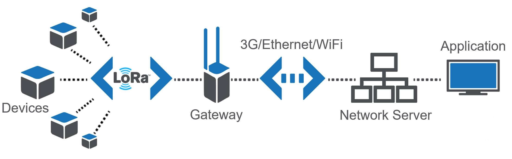
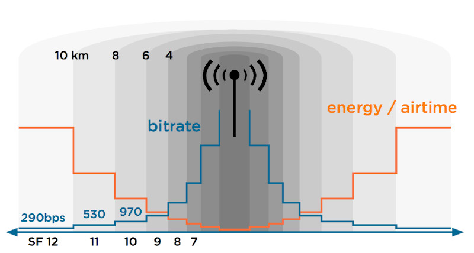

:Title: LoRaWAN Network
:Date: Fri Sep 4 13:48:16 CEST 2018
:Category: blog
:Tags: lorawan, iot, network
:Summary: About LoraWAN Network
:Modified: 2020-01-10

LoRaWAN Network
===============

.. contents:: Table of Contents

About LoRaWAN
-------------

LoRaWAN is a point-to-multipoint networking protocol that uses Semtech’s LoRa
modulation scheme. 

The interesting thing is not about radio waves but how radio waves communicate with
LoRaWAN gateways encryption and identification, and to not forget LoRa is one
of the most competitive technologies because of its low power consumption and
low cost design.

LoRaWAN stands for Long Range Wide Area Network. It’s a standard for
wireless communication that allows IoT devices to communicate over large
distance with minimal battery usage. This post is a try to explain
LoRaWAN in a technical but simply understandable way.

LoRa or LoRaWAN
~~~~~~~~~~~~~~~

* LoRa = Physical Layer
* LoRaWAN = MAC Layer

LoRa defines the standard for the physical (layer 1), LoRaWAN defines
all that plus the MAC layer and application standards.

-  LoRa defines the physical layer, the reason behind the long-range
   communication. LoRaWAN defines the communication protocol and system
   architecture for the network.
-  LoRa refer to a wireless modulation allowing a low power high radio
   budget communication. LoRaWAN refer to a network protocol using LoRa
   chips for the communication.
-  We can use LoRa modulation in networks without LoRaWAN. We can also
   use LoRaWAN like network without LoRa radio, but it won’t be
   practical.
-  LoRa is Chirp Spread Spectrum (CSS) modulation used to provide
   different data rates using different spreading factors. LoRaWAN is
   wireless network used as Wide Area Network (WAN) due to its wide
   coverage capabilities.

The main characteristics of LoRaWAN are:

* Long range (>5 km urban, >10 km suburban, >80 km VLOS)
* Long battery life (>10 years)
* Low cost (<$5/module)
* Low data rate (0.3 bps – 50 kbps, typically ~10 kB/day)
* Secure
* Operates in unlicensed spectrum
* Localisation support
* Bidirectional
* Signal bounce effect in urban environment (works with no line of sight)

As you can see in the list of characteristics, everything sounds
outstanding except when we’re looking at the data rate. Unfortunately,
physically limited, wireless communication is always a trade off between
distance, speed and power (energy). LoRa was designed with use cases in
mind where this data rate should be enough and the other characteristics
are way more important.

LoRaWAN was also designed with large service providers in mind. Just as
with the cellphone network: a few operators that maintain and control
the network and millions of users that exploit the network and do not
need to care about the infrastructure. Nevertheless, since LoRa is
operating in unlicensed spectrum, its perfectly possible to set up your
own gateway(s), have a coverage of a few kilometers and run your own
network for a few hundred Euro or Dollar.

Use cases
---------

As mentioned before, LoRa allows for low power, long range but low data
rates. Typical use cases can be found in the IoT (Internet of Things),
IoE (Internet of Everything) or M2M (Machine to Machine) area, or
industrial internet of things (IIoT).

We’re typically looking at (small) sensors/devices/things that are
battery operated and communicate limited information on a limited
interval (`Fair Access Policy`_ and `Duty Cycle`_)

Some examples of use cases:

-  Telemetry:

   -  Sends 1 to 5 messages a days about the current usage
   -  For example: gas/water/electricity
   -  (~10) years on battery

-  Smart beehives:

   -  Telemetry for beekeepers (weight, temperature, humidity, sound)

-  Precision agriculture:

   -  Telemetry for wine makers 
   -  Monitoring/predictions orchard/vineyards

-  Social science telemetry:

   -  passenger/visitors flow measurements in real-time (it counts how many mobile devices are around)
   -  PAX counter's

-  Smart parking:
  
   -  Sends a message when a vehicle arrives or leaves a parking spot
   -  Can be combined with an app to find a free parking spot
   -  No cabling required, low maintenance

-  Smart bin:

   -  Sends a message when a trashcan is full
   -  Optimize route for garbage collection, save labor and fuel

-  Smart lighting:

   -  Control streetlight status and operation

-  Environment monitoring

   -  For example: sound, temperature, pollution, radiation, humidity,…
   -  Create valuable insights in combination with Geo location
   -  air pollution (PM) / forest fires

-  Asset management

   -  Check status and location of various assets
   -  Control tanks, relays, locks, lights, devices status

-  Healthcare

   -  For example: activity/fall detection, personal alarm, status
   -  Low power consumption, great network coverage

-  Tracking

   -  Track goods, vehicles, animals

Architecture
------------

From a high level, the architecture of a typical LoRa network looks like
the following:

Devices -> LoRa radio -> Gateway -> 3G/Ethernet -> Network Server ->
Application

.. code-block:: text

   Node Device --(LoRa RF)--> Gateway --(LoRaWAN TCP/IP)--> Network Server ---> Application Server

   #---------- MAC Layer Communication (Network Session Key) -------------#

   #------------------- Application Layer Communication (Application Session Key) ---------------#

   LoRaWAN arhitecture
   

For upstream messages, for example a sensor that sends information to an
application, the flow is from left to right. The sensor value (payload)
gets encrypted and gets transmitted over LoRa radio. One or more
gateways receive the message and forward it over another network
(typically 3G or Ethernet) to a Network Server. The Network Server
routes the message to the correct end application.

For downstream messages, for example a signal to turn on a light, the
flow is from right to left. Upstream messages are initiated by the
device itself and downstream by the end application. Since LoRa is
designed with as low energy usage as possible, not all devices are
always listening for incoming messages. This depends on the device
classes

In the next chapters, I’ll go deeper into each component of the above
diagram and try to go a little more into detail for each.

Devices
-------

LoRaWAN devices can be anything that sends or receives information,
there is no real definition for them but usually we’re speaking about
sensors, detectors, actuators.

Some examples of devices:

-  Adeunis LorRaWAN demonstrator
   (http://www.adeunis-rf.com/en/products/lorawan-products/lorawan-demonstrator-by-adeunis-rf)

   -  This is a device to deminstrate LoRa
   -  GPS / Temperature / Accelerometer sensor
   -  Self-powered and rechargeable

-  NKE Watteco smartplug

   -  Ability to turn connected device on/off
   -  Measures power, voltage and frequency

-  Abeeway

-  Raspberry Pi or Ardunio

   -  Combined with sensors: temperature, pressure, humidity, light,
      sound, GPS Location, accelerometer, motion detector, air quality,
      mangetic switch,…

Device classes
~~~~~~~~~~~~~~

-  **A**: Can only receive a message at the time the device is sending a
   message
-  **B**: Same as A but listens for incoming messages on regular
   intervals
-  **C**: Continuously listening for incoming messages

Logically, class A devices can last the longest on battery and class C
devices are typically not battery powered.

The LoRaWAN standard describes two different types of messages: MAC
messages, to control the radio and network and data messages, the actual
payload that is application/device specific. Since we’re limited in the
time and number of messages we can send over the air, MAC messages can
be piggybacked (send together) with data messages and multiple MAC
messages can be sent in one time.

Device addressing
~~~~~~~~~~~~~~~~~

As with most networking standards, devices need some kind of address and
identification to be able to contact them and differentiate them from
each other. LoRa uses the following addressing.

-  **DevEUI**: Device unique hardware ID: 64 bits address. Comparable
   with a MAC-addresss for a TCP/IP device.

-  **DevAddr**: Device address: 32 bits address assigned or chosen
   specific on the network. Comparable with an IP address for a TCP/IP
   device.

-  **AppEUI**: Application ID: EUI64 address format. Uniquely identifies
   the application provider of the device. Then AppEUI is stored in the
   end-device before the activation procedure is executed.

-  **Fport**: identifies end application/service. Port 0 is reserved for
   MAC messages. Comparable with a TCP/UDP port number for a TCP/IP
   device.

LoRa radio
----------

LoRa is using RF signals to communicate. It’s operating in unlicensed
spectrum. This means that everybody can freely use this band without
paying or getting a license as longs as you follow some regulations.
Specifically, LoRa is operating in the ISM (Industrial, Science,
Medical) band. Unfortunately, the ranges in the ISM band are
geographically different.

To accomplish the goals of LoRa in terms of range and data rate, the
following frequencies are used: Europ: 868Mhz and 433 Mhz, US: 915Mhz
and AS: 430 Mhz. Obviously this makes gateways and devices for Europe
incompatible with the ones manufactured for the US, etc. A big
disadvantage for LoRa if you ask me.

LoRa is using different techniques to improve data reliability. I will
try to mention the most important ones:

-  Spread Spectrum: This a technique originally designed for military
   applications where the actual information (for example one bit) is
   spread over a larger frequency. By doing this, the signal to noise
   ration is very small and the signal (the bit sent) is much more
   resistant to noise, interference or jamming signals.

-  ADR: Adaptive Data Rate: Dynamically change the data rate and
   transmit power in function of the signal quality and distance to the
   gateway. Slower transmission (higher spreading factor) allows for a
   longer and more reliable range:

   ADR

-  FEC: Forward Error Correction: Add redundant information
   (recovery/parity bits) to each message to be able to correct small
   errors

RSSI
----

Received Signal Strength Indication (RSSI) is the received signal power
in milliwatts and is measured in dBm. This value can be used as a
measurement of how well a receiver can “hear” a signal from a sender.

The RSSI is measured in dBm and is a negative value.

The closer to 0 the better the signal is.

• Typical LoRa RSSI values are:

.. code-block:: text

   RSSI minimum = -120 dBm.
   If RSSI=-30dBm: signal is strong.
   If RSSI=-120dBm: signal is weak.

SNR
---

- Signal-to-Noise Ratio (SNR) is the ratio between the received power signal
  and the noise floor power level.  

- The noise floor is an area of all
  unwanted interfering signal sources which can corrupt the transmitted signal
  and therefore re-transmissions will occur

Typical LoRa SNR values are between:

.. code-block:: text

   -20dB and +10dB

- A value closer to +10dB means the received signal is less corrupted. 
- LoRa can demodulate signals which are -7.5 dB to -20 dB below the noise floor.

so, Make sure your SNR is between typical values to get more LoRa signal
strength.

`Wiki SNR`_

.. _`Wiki SNR`: https://en.wikipedia.org/wiki/Signal-to-noise_ratio

Gateway
-------

The gateway, also called modem or access point, is the device that is
receiving all LoRa radio sent by the devices in it’s range. By design,
there isn’t really a association between a device and a specific LoRa
gateway. Every gateway in the range of the RF signal sent out by a
device will pick up the signal and process it, even if this LoRa gateway
is part of a network that doesn’t know the device that sent the message.

.. Some examples of LoRa gateways currently available:

The Things Stack for LoRaWAN
----------------------------

New all in one solution :)

`LoraWAN Stack`_

.. _`LoraWAN Stack`: https://github.com/TheThingsNetwork/lorawan-stack

Network Server
--------------

After a device sent a message that was received by a LoRa gateway, it
will most likely be forwarded to a Network Server. This component is the
most intelligent part in the LoRaWAN network. The Network Server is
responsible for the following taks:

-  Aggregate the incoming data from all LoRaWAN gateways in it’s network
   and all sensors in the range of them.
-  Route/forward incoming messages to the correct end application
-  Contral LoRa radion configuration to the gateways
-  Select the best gateway for downlink message in case multiple
   gateways are in the range of one device
-  Downlink buffering: store messages until a LoRa class A or B device
   is ready to receive a message
-  Remove duplicates: since there is no association between device and
   gateway there is a good chance that multiple gateways pick up the
   same message so dulicates need to be filtered
-  Monitor the devices and gateways

Some examples of Network Server software:

.. Add some GW exaples

.. code:: text

   Actility Thingpark: https://www.actility.com/products/
   Loraserver: https://github.com/brocaar/loraserver
   Semtech: https://semtech.force.com/lora

In most cases, the network server will route/forward the message from a
certain id and fport combination to a predefined application. Usually
this is done by either forwarding it to a HTTP(S) webservice or putting
it into an MQTT queue.

Duty Cycle
----------
Duty cycle is the proportion of time during which a component, device, or
system is operated. In other words indicates the fraction of time a resource is
busy.

The duty cycle can be expressed as a ratio or as a percentage.

In Europe, duty cycles are regulated by section 7.2.3 of the ETSI
EN300.220 standard. This standard defines the following sub-bands and
their duty cycles:

.. code:: text

   g (863.0 – 868.0 MHz): 1%
   g1 (868.0 – 868.6 MHz): 1%
   g2 (868.7 – 869.2 MHz): 0.1%
   g3 (869.4 – 869.65 MHz): 10%
   g4 (869.7 – 870.0 MHz): 1%

The percentage of the ratio of pulse duration, or pulse width (PW) to
the total period (T) of the waveform.

.. code:: text

   Duty Cycle = PW/T * 100%

Details: https://www.thethingsnetwork.org/docs/lorawan/duty-cycle.html

Fair Access Policy
~~~~~~~~~~~~~~~~~~

The Things Network’s public community network, we have a Fair Access
Policy that limits the uplink airtime to 30 seconds per day (24 hours)
per node and the downlink messages to 10 messages per day (24 hours) per
node. If you use a private network, these limits do not apply, but you
still have to be compliant with the governmental and LoRaWAN limits.

Compliance
~~~~~~~~~~

-  Every radio device must be compliant with the regulated duty cycle
   limits. This applies to both nodes and gateways.

-  Calculate how much airtime each message consumes using one of the
   many `airtime calculators <https://docs.google.com/spreadsheets/d/1QvcKsGeTTPpr9icj4XkKXq4r2zTc2j0gsHLrnplzM3I/edit>`__
   and use that information to choose a good transmit interval.

Security
--------

As I mentioned in the beginning of this article, LoRaWAN is designed
with security in mind, 

The basic idea is that communication should be secure on multiple
levels. A Network Server does not need to be able to read the actual
contents of the message if it’s not relevant for the network or
infrastructure. Therefore there are two different keys in the picture
during normal message exchange:

-  The network session key (NwkSKey) is used to encrypt the whole frame
   (headers + payload) in case a MAC-command is sent. When data is sent,
   this key is used to sign the message which allows the network server
   to verify the identity of the sender
-  The application session key (AppSKey) is used to encrypt the payload
   in the frame. This key doesn’t need to be known by the Network Server
   to be able to know where to forward the message to. The application
   server then decrypts the information using the same key.

Joining the network
~~~~~~~~~~~~~~~~~~~

Until here, things are still quite understandable but the way that a
device can join the network makes it more complicated. Since you
wouldn’t want that for every application/use case, that the user is
responsible for configuring network access/subscriptions/service
provider choice but you also wouldn’t want any type of device to be tied
to a specific network there re basically two ways of activating a device
on a LoRa network.

The goal of this activation process is to get a NwkSKey, AppSKey and
NwkAddr. Once these are received or configured, the rest of the
communication is exactly the same for both of the activation methods.

Activation By Personalization (ABP)
~~~~~~~~~~~~~~~~~~~~~~~~~~~~~~~~~~~

ABP is the most simple way to activate a LoRa device on a network. With
ABP, the supplier of the device agrees with the network provider and
buys/reserves a range of DevAddr from a network provider and
pre-provisions his devices with this. Once the device is turned on, it’s
immediately ready to send data. There is no over the air join process.

Steps in the progress:

1. Manufacturer.supplier of LoRa device buys connectivity from the
   network operator. AppSKey is generated in advance.
2. Service provider is delivering a NwkSKey and DevAddr for each DevEU.
3. Before shipping devices, they are pre-provisioned with: NwkSKey,
   AppSKey and DevAddr
4. On first use, there is no need to join the network and the device can
   communicate immediately as they already know the necessary
   information

Over The Air Activation (OTAA)
~~~~~~~~~~~~~~~~~~~~~~~~~~~~~~

In the OTAA mode, an end node communicates with the network server to perform
the activation process, which is called join procedure
OTAA is a little more complicated but allows for devices to join any
network in the range and doesn’t require a special agreement between
network operator and the device supplier. As with ABP, the goal of the
process is to become the NwkSKey, DevAddr and AppSKey for each device
prior to sending actual data.

To retrieve this information in a secure way, there is an extra key
involved which is pre-provisioned in the device: the Appkey. 
The Appkey is a different 128 bit key.

Steps in the OTAA join process:

1. LoRa Device sends JOIN_REQUEST (signed with AppKey). The join request
   contains the following information: AppEUI, DevEUI, DevNonce.
   DevNonce is a randomly generated number by the end node.
   An application key (AppKey) is preshared between the end node and the network server.
2. The Network Server receives the JOIN_REQUEST and calculates AppSKey
   and NwkSKey based on: AppKey, AppNonce, NetID and DevNonce. As with
   DevNonce, the AppNonce is randomly generated number by the network server.
3. Network Server generates JOIN_ACCEPT and includes AppNonce
4. Device receives JOIN_ACCEPT (encrypted with AppKey). The JOIN_ACCEPT
   contains the following information: AppNonce, NetID, DevAddr, RFU,
   RxDely, CFList Since at this point both the Network Server and LoRa
   device have the same information, the LoRa device can equally
   calculate the NwkSkey and AppSKey
   Finally, the whole join accept message is encrypted with the AppKey.
5. Transfer App_SKey
6. After receiving the join accept message, the end node decrypts it and
   generates session keys using extracted parameters.

If reading carefully, you can see that at no point in the whole progress
keys are sent over the air but only the missing parts of a calculation,
from both sides are exchanged. This makes it impossible to generate any
key by intercepting traffic over the air.

All the above explanation is far from complete but I hope that my brief
explanation of it give a better understanding of this technology. I’ll
try to add some clarifications and/or graphs/schemes in the near future.

Encode & Decode Messages
------------------------

Example server side decoder function

.. code:: javascript

  function bin2String(array) {
     var result = "";
     for (var i = 0; i < array.length; i++) {
        result += String.fromCharCode(parseInt(array[i], 10)); 
    } 
    return result; 
  }

  function Decoder(bytes, port) { var decoded = {};
     decoded.pm10 = bytes[0] + (bytes[1]<<8);
     decoded.pm25 = bytes[2] + (bytes[3]<<8);
     decoded.temperature = ((bytes[5]<<8) + bytes[4])/100 - 273.15;
     decoded.humidity = ((bytes[7]<<8) + bytes[6])/100;
     decoded.vbatt = (bytes[9]<<8) + bytes[8];
     decoded.duration = (bytes[11]<<8) + bytes[10];
     decoded.version = bin2String(bytes.slice(12, bytes.length));
     return decoded;
  }

Read more `TTN Forum source`_

.. _`TTN Forum source`: https://www.thethingsnetwork.org/forum/t/is-there-any-documentation-on-payload-functions/3441/3

Terminology
-----------

* LPWAN

  Is not a single technology, but a group of various low-power, wide area
  network technologies that take many shapes and forms. LPWANs can use licensed
  or unlicensed frequencies and include proprietary or open standard options.
  Created for machine-to-machine (M2M) and internet of things (IoT) networks,
  LPWANs operate at a lower cost with greater power efficiency than traditional
  mobile networks. They are also able to support a greater number of connected
  devices over a larger area.

* Narrowband-IoT 

  (NB-IoT) and LTE-M are both 3rd Generation Partnership Project (3GPP)
  standards that operate on the licensed spectrum. 

* Telemetry 
  is the collection of measurements or other data at remote or inaccessible
  points and their automatic transmission to receiving equipment for
  monitoring. The word is derived from Greek the roots tele, "remote", and
  metron, "measure". source: wikipedia_

.. _wikipedia: https://en.wikipedia.org/wiki/Telemetry
