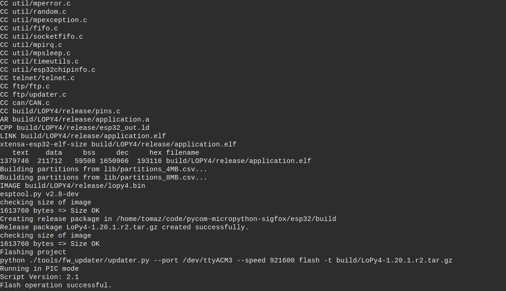
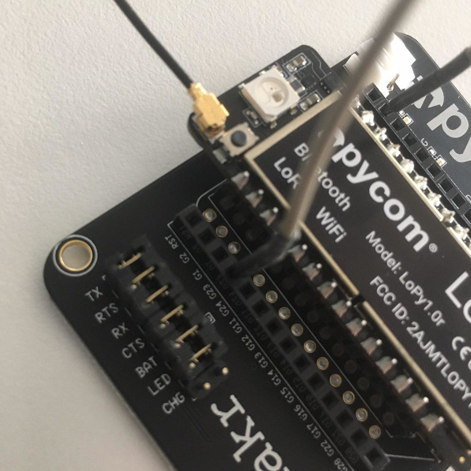

:title: MicroPython and Lopy
:date: 2017-03-17 00:31
:tags: iot, python, lorawan, micropython, esp32
:category: projects
:slug: micropython-lopy
:modified: 2019-05-05 21:07
:summary: How to setup and use lorawan device, using MicroPython and Lopy
          (ESP-32) module

Micropython and Lopy
====================

About ruining Python on bare metal, using Pycom_ Lopy and Micropython_.

.. _Pycom: https://pycom.io/
.. _Micropython: https://micropython.org/

`Awesome MicroPython`_
.. _`Awesome MicroPython`: https://python.awesome-programming.com/en/awesome/gh-100020/awesome-micropython

.. contents:: Table of Contents

Lopy
----

* `Official documentation`_
* Pinout_
* Frmware_

.. _`Official documentation` : https://docs.pycom.io/
.. _Pinout : https://docs.pycom.io/gitbook/assets/lopy4-pinout.pdf
.. _Frmware : https://docs.pycom.io/pytrackpysense/installation/firmware/

Start
-----

* 5V
* Micro USB cable
* Lopy and board (Expansion, Pysense, Pytrack..)
  

FTP 
~~~

Connect to access point with name `lopy-[random characters]` and credentials:

.. code-block:: text

   u: admin
   p: www.pycom.io

Telnet 
~~~~~~

.. code-block:: shell

   $ telent 192.168.4.1

Serial 
~~~~~~

Connecting to UART we can use any program rshell or minicom, screen..

Get information about ports:

.. code-block:: shell

  dmesg | egrep --color 'serial|ttyS'

  content

Connect to device with `rshell`

.. code-block:: shell

   pip install rshell

.. code-block:: shell

   rshell -p /dev/ttyUSB0 --buffer-size=30 

.. code-block:: shell

   rshell -p /dev/ttyACM0 --buffer-size=30"

Copy file to device

.. code-block:: shell

   cp <file-name> /flash/

Copy directory

.. code-block:: shell

   cp -r <directory-name> /flash/<directory-name>

Rsync project

.. code-block:: shell

   rsync -mv <directory-name>/ /flash/

After connecting to device over serial enter in REPL mode

.. code-block:: shell

   $ repl

Exit REPL

   `CTRL - X`

Code example
------------

Project structure

.. code-block:: text

    project/                 
    ├── lib/       <--- Place for sensors drivers
    ├── boot.py    <--- First file to be executed on start up
    ├── config.py  <--- Global variables
    └── main.py    <--- Executed after boot

Config file
~~~~~~~~~~~

.. code-block:: python

    # config.py

    DEV_ID = "<DEV_ID_REGISTERED_ON_LORA_SERVER"

    # TTN Registered Device IDs
    DEV_EUI = '<DEVICE-EUI>'
    APP_EUI = '<APPLICATION-EUI>'
    APP_KEY = '<APPLICATION-KEY>'

    # Debug
    DEBUG_LED = True
    DEBUG_CON = True

    # LoRa setup
    LORA_FREQUENCY = 868100000

    # Activate confirmation message
    LORA_STATUS = True

    # Data Rate (0 - 7)
    LORA_DR = 5 # DR_5

    # Bind socket to port
    SOCK_PORT = 1

    # Sleep time in packet send
    SLEEP_MAIN = 300

    # Low Energy config
    HEARTBEAT = False

    # LED color
    LED_OFF = 0x000000
    GREEN = 0x007f00
    YELLOW = 0x7f7f00
    RED = 0x7f0000
    BLUE = 0x00007f

Boot file
~~~~~~~~~

.. code-block:: python

    # boot.py -- run on boot-up

    import os
    import machine

    # Enable REPL duplication on UART0
    uart = machine.UART(0, 115200)
    os.dupterm(uart)

    # Run main module
    machine.main('main.py')

Main file
~~~~~~~~~

.. code-block:: python

    """
    Basic LoRa example based on OTAA (Over The Air Authentication)
    """

    from network import LoRa
    from network import WLAN
    import binascii
    import pycom
    import socket
    import time
    import config as c

    # Set heartbeat
    pycom.heartbeat(c.HEARTBEAT)

    # Initialize LoRa in LORAWAN mode.
    lora = LoRa(mode=LoRa.LORAWAN)

    # create an OTA authentication params
    dev_eui = binascii.unhexlify(c.DEV_EUI.replace(' ', ''))
    app_eui = binascii.unhexlify(c.APP_EUI.replace(' ', ''))
    app_key = binascii.unhexlify(c.APP_KEY.replace(' ', ''))

    if machine.reset_cause() != machine.DEEPSLEEP_RESET:
        lora.nvram_erase()
        if c.DEBUG:
            print("[i] Lora nvram erased!")
    else:
        lora.nvram_restore()
        print("[i] Lora nvram restored!")

    if not lora.has_joined():
        # Join a network using OTAA
        if c.DEBUG:
            print("[i] Joining LoRa network")

        # Join a network using OTAA
        lora.join(activation=LoRa.OTAA, auth=(dev_eui, app_eui, app_key), timeout=0)

        # Wait until the module has joined the network
        fails = 0
        while not lora.has_joined():
            fails += 1
            if c.DEBUG:
                print("[w] Not joined yet... {}".format(fails))
                blinker(c.LED_RED)
            # Time between joins
            time.sleep(2.5)
            if fails >= c.JOIN_FAILS:
                if c.DEBUG:
                    blinker(c.LED_RED, n=3)
                fails = 0
                machine.idle()

    # Create a LoRa socket
    sock = socket.socket(socket.AF_LORA, socket.SOCK_RAW)

    # Set the LoRaWAN data rate
    sock.setsockopt(socket.SOL_LORA, socket.SO_DR, c.LORA_DR)

    if c.LORA_STATUS:
        # Selecting confirmed type of messages
        sock.setsockopt(socket.SOL_LORA, socket.SO_CONFIRMED, True)

    # Bind to port used then on ttn application inside payload switch
    sock.bind(c.SOCK_PORT)

    # Make the socket blocking
    sock.setblocking(False)

    # To make connection available wait 5 seconds
    if c.DEBUG:
        blinker(c.LED_BLUE, t=5, s=1)
        print("[i] Joined!")
    else:
        time.sleep(5.0)

    i = 0
    # Example loop
    # Terminate in CTRL-C
    # See threading example
    while True:
        # Prepare the packet
        # send 'hi' as raw byte data (hex format)
        pkt = bytes([0x68, 0x69])

        # Send it
        s.send(pkt)
        if c.DEBUG_CON:
            print('send >> ', pkt)
        if c.DEBUG_LED:
            pycom.rgbled(c.GREEN)
            time.sleep(0.1)
            pycom.rgbled(c.LED_OFF)
        # Wait to receive packet
        time.sleep(4)
        rx = s.recv(256)
        if rx and c.DEBUG_CON:
            pycom.rgbled(c.BLUE)
            time.sleep(0.1)
            pycom.rgbled(c.LED_OFF)
            print("receive << ", rx)
        # Sleep 10 min
        time.sleep(c.SLEEP_MAIN)
        i += 1

Code snippets
-------------

.. code-block:: python

    >>> def work_handler(alarm):
            print("Do some work here...")

    >>> machine.Timer.Alarm(work_handler, s=(60), periodic=True)

Building a firmware image
-------------------------

  

Requirements
~~~~~~~~~~~~

* Pycom MicroPython source code
* Xtensa gcc compiler
* Espressif IoT Development Framework

Debian/Ubuntu
~~~~~~~~~~~~~

.. code-block:: shell

    sudo apt-get install gcc git wget make libncurses-dev flex bison gperf
    python python-serial

Build environment
~~~~~~~~~~~~~~~~~

Make build project directory

.. code-block:: shell

    $ cd $HOME && mkdir pycom-build

Source code
~~~~~~~~~~~
Get Pycom MicroPython source code

.. code-block:: shell

    $ git clone https://github.com/pycom/pycom-micropython-sigfox

Check out to latest stable version (output on date 2018-07-23)

.. code-block:: shell

    $ git tags

        1.11.0.b1
        1.12.0.b1
        1.13.0.b1
        1.6.13.b1
        v1.14.0.b1
        v1.15.0.b1
        v1.16.0.b1
        v1.17.0.b1
        v1.17.2.b1
        v1.17.3.b1
        v1.18.0
        v1.18.0.r1    <--- Check out tag
        v1.18.0.r1-0.
        v1.19.0.b2
        v1.19.0.b3
        v1.19.0.b4

    $ git checkout v1.18.0.r1

Xtensa
~~~~~~

Install xtensa gcc compiler

.. code-block:: shell

    $ cd $HOME/pycom-build
    $ wget https://dl.espressif.com/dl/xtensa-esp32-elf-linux64-1.22.0-80-g6c4433a-5.2.0.tar.gz
    $ tar -xzf xtensa-esp32-elf-linux64-1.22.0-80-g6c4433a-5.2.0.tar.gz
    $ export PATH=$PATH:$HOME/pycom-build/xtensa-esp32-elf/bin

Verify content of $PATH variables:

.. code-block:: shell

    $ echo $PATH

Verify toolchain installation:

.. code-block:: shell

    $ xtensa-esp32-elf-gcc -v

If command returns `xtensa-esp32-elf-gcc: Command not found` recheck the the
export command!

ESP-IDF
~~~~~~~

Install ESP-IDF tools

.. code-block:: shell

    $ cd $HOME/pycom-build
    $ git clone https://github.com/pycom/pycom-esp-idf.git
    $ cd pycom-esp-idf
    $ git submodule update --init
    $ export IDF_PATH=$HOME/pycom-build/pycom-esp-idf

More details:

* pycom-esp_
* esp-idf_
* pycom-micropython-sigfox_
* espressif_

.. _pycom-esp: https://github.com/pycom/pycom-esp-idf
.. _esp-idf: https://esp-idf.readthedocs.io/en/latest/get-started/linux-setup.html
.. _pycom-micropython-sigfox: https://github.com/pycom/pycom-micropython-sigfox
.. _espressif: https://docs.espressif.com/projects/esp-idf/en/release-v3.0/get-started/linux-setup.html

Build process
~~~~~~~~~~~~~

Read this first: https://github.com/pycom/pycom-micropython-sigfox

* 1. Build mpy-cross

.. code-block:: shell

    $ $HOME/pycom-build/pycom-micropython-sigfox
    $ cd mpy-cross && make clean && make && cd ..

* 2. Frozen modules (OPTIONAL)

Add custom python modules to include in the firmware in following directory:

.. code-block:: shell

    $HOME/pycom-build/pycom-micropython-sigfox/esp32/frozen/Custom

* 3. Board build

Currently support for the following BOARD types:

.. code-block:: shell

    WIPY LOPY SIPY GPY FIPY LOPY4

.. code-block:: shell

    $ cd $HOME/pycom-build/pycom-micropython-sigfoxesp32/esp32
    $ make BOARD=LOPY clean
    $ make BOARD=LOPY -j5 TARGET=boot

For LoRa need to specify the `LORA_BAND`

.. code-block:: shell

    # LORA_BAND=USE_BAND_868
    # LORA_BAND=USE_BAND_915

    $ make BOARD=LOPY -j5 LORA_BAND=USE_BAND_868 TARGET=app

* 4. Flash the image on board

**Pysense board**

The pysense board enter automatic in programming mode

.. code-block:: shell

    # On linux
    $ make BOARD=LOPY -j5 ESPPORT=/dev/ttyACM0 flash

**Extension board**

Put in programming mode connect GND to P23

.. code-block:: shell

    # On linux
    $ make BOARD=LOPY -j5 ESPPORT=/dev/ttyUSB1 flash

    # On MacOSX
    $ make ESPPORT=/dev/tty.usbserial-DQ008HQY flash

Rebuild process
~~~~~~~~~~~~~~~

Making rebuild looks like this:

.. code-block:: shell

  export PATH=$PATH:$HOME/pycom-build/xtensa-esp32-elf/bin
  export IDF_PATH=$HOME/pycom-build/pycom-esp-idf
  $HOME/pycom-build/pycom-micropython-sigfox/esp32/
  make BOARD=LOPY4 clean
  make BOARD=LOPY4 release
  make BOARD=LOPY4 -j5 ESPPORT=/dev/ttyACM3 flash

Encryption
----------

Use make SECURE=on [optionally SECURE_KEY ?= secure_boot_signing_key.pem] to
enable Secure Boot and Flash Encryption mechanisms.

Use make V=1 or set BUILD_VERBOSE in your environment to increase build
verbosity.

Reference
~~~~~~~~~

* `pycom micropython`_

.. _`pycom micropython`: https://github.com/pycom/pycom-micropython-sigfox#the-esp32-version

Firmware Update
===============

.. table:: Programming Modes

   ===  ===  ===============
   Pin  Pin  Case
   ===  ===  ===============
   G23  GND  Expansion Board
   P2   GND  Lopy
   ===  ===  ===============

| 
| 

