:title: LoraWAN Reverse Beacon
:date: 2018-05-27
:tags: iot, python, lorawan, reverse_beacon
:category: blog
:slug: lorawan-reverse-beacon
:summary: Exploring LoraWAN coverage with drop node deployed higher than the receivers

Reverse-Beacon
==============

.. contents:: Table of Contents

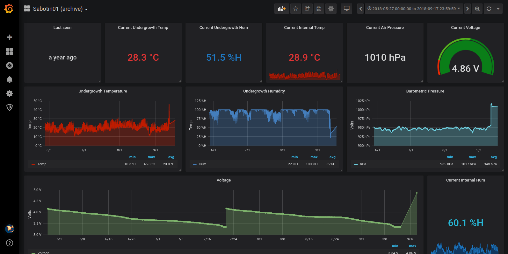

------------

Status project:

* **Started**: 05.27.2018
* **Archived**: 09.17.2018

------------

The device is kind of reverse-beacon node on the Sabotin mountain and
monitor TheThingsNetwork gateways in the signal range.

The node is transmitting packages to the gateways stations listening and
reporting what stations they hear, when and how well.

In the meantime is taking measurements (temperature and humidity) of undergrowth.

**Collected measurements:**

* Temperature & Humidity (undergrowth)
* Atmospheric pressure
* Device internal (temperature, humidity and current voltage)

Link to public archived data: sabotin01_

.. _sabotin01: https://lepavida.iot.novagorica.eu/d/000000012/sabotin01-archive

Location
--------

Sabotin (top)
Geo location: 45.9883, 13.63469

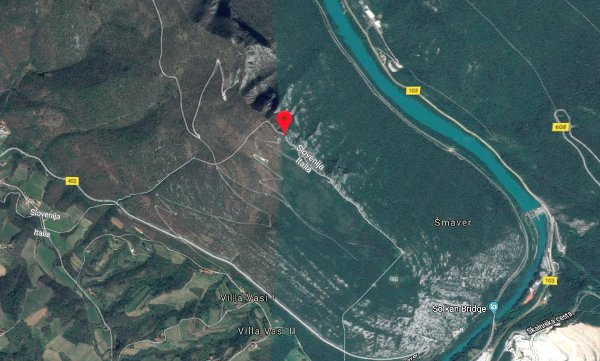

   Device geo location

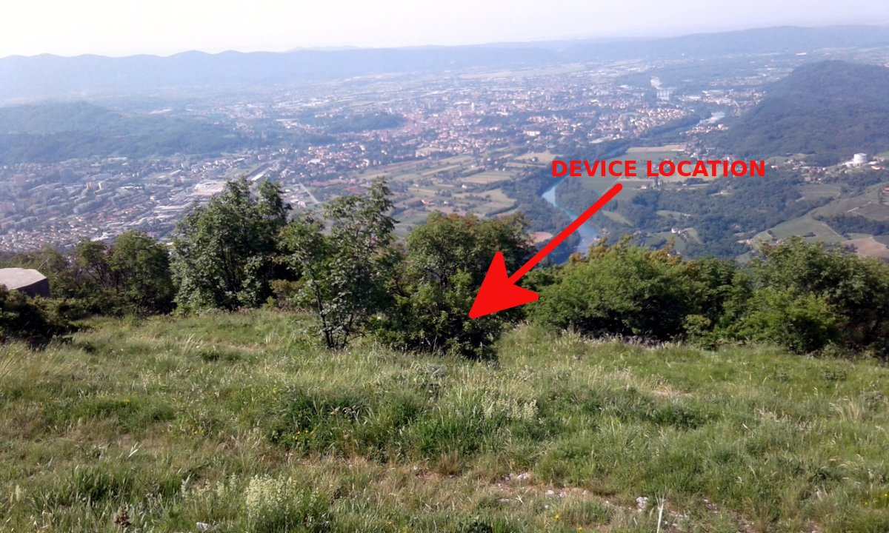

   The LoraWAN bush

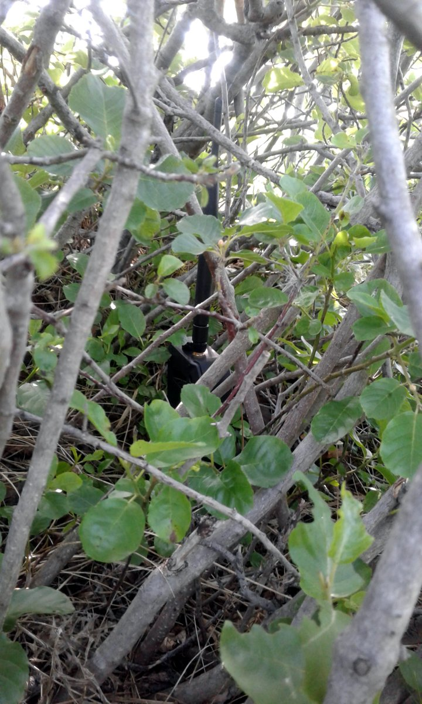

   Device bush installation

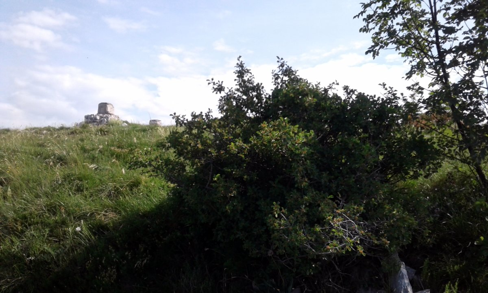

   Look at the bush from another angle

   #1 View from the location of the device

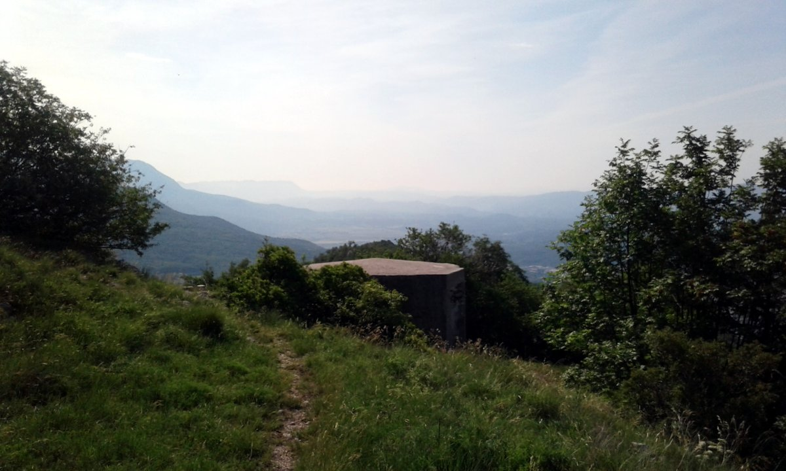

   #2 View from the location of the device

Internals
---------

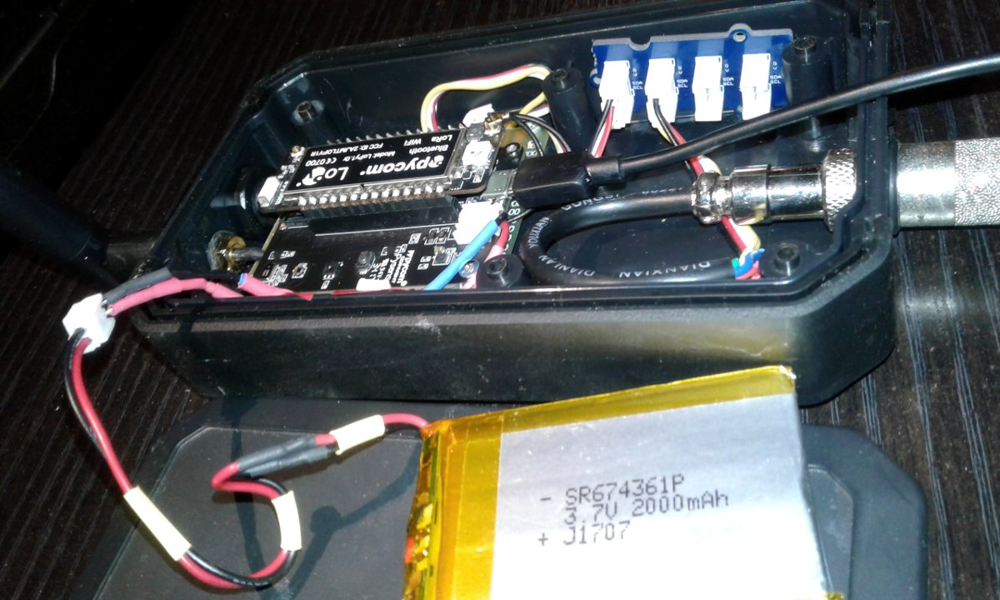

   Device internals

Summary
-------

To be aware, dispose of the device/node in nature with any LiPo/Li-Ion battery it can
be a dangerous think, from fire ignition perspectives. The purpose of this
experiment was show case for monitoring the temperature of undergrowth in fire
alarming scenario!

Parts
-----

.. table:: Table of all hardware components included in device

  +-----+-------------------+-------+------------------------------------------------------------+
  | Qty | Name              | Link  | Description                                                |
  +=====+===================+=======+============================================================+
  | 1   | `SHT10`_          | `1`_  | Mesh-protected Weather-proof Temperature/Humidity Sensor   |
  +-----+-------------------+-------+------------------------------------------------------------+
  | 1   | `MPL3115A2`_      | `2`_  | Air Pressure - Pysense                                     |
  +-----+-------------------+-------+------------------------------------------------------------+
  | 1   | `SI7006A20`_      | `2`_  | Air Temperature & Humidity - Pysense                       |
  +-----+-------------------+-------+------------------------------------------------------------+
  | 1   | `Milvent`_        | `8`_  | M6 Screw in Vent                                           |
  +-----+-------------------+-------+------------------------------------------------------------+
  | 4   | `I2C Hub`_        | `9`_  | Extension Grove module for connecting multiply I2C devices |
  +-----+-------------------+-------+------------------------------------------------------------+
  | 5   | `I2C Cable`_      | `10`_ | I2C Cable                                                  |
  +-----+-------------------+-------+------------------------------------------------------------+
  | 3   | `I2C Jump Cable`_ | `11`_ | Grove universal cable 10cm                                 |
  +-----+-------------------+-------+------------------------------------------------------------+
  | 1   | `Li-Po Battery`_  | `12`_ | Lithium ion battery                                        |
  +-----+-------------------+-------+------------------------------------------------------------+
  | 1   | `LoPy`_           | `13`_ | Module v1.2                                                |
  +-----+-------------------+-------+------------------------------------------------------------+
  | 1   | `Pysense`_        | `14`_ | Module Board                                               |
  +-----+-------------------+-------+------------------------------------------------------------+
  | 1   | `Antenna`_        | `15`_ | Universal LoRa & Sigfox Antenna Ki                         |
  +-----+-------------------+-------+------------------------------------------------------------+
  | 1   | `Enclosure`_      | `16`_ | IP67 Case                                                  |
  +-----+-------------------+-------+------------------------------------------------------------+
  | 20  | `Spacers Screws`_ | `17`_ | M3 Nylon Black M-F Hex Spacers Screw Nust                  |
  +-----+-------------------+-------+------------------------------------------------------------+
  | 5   | `O Ring Seal`_    | `18`_ | Flexible Rubber O Ring Black                               |
  +-----+-------------------+-------+------------------------------------------------------------+

.. _1: https://www.adafruit.com/product/1298
.. _2: https://pycom.io/product/pysense/
.. _8: https://www.aliexpress.com/item/protective-vents-pressure-balance-valve-IP69K-waterproof-Valve-span-class-wholesale-product-span-IP68-vent-plug/32724507421.html
.. _9: https://www.tme.eu/en/details/seeed-103020006/sensor-modules/seeed-studio/i2c-hub/
.. _10: https://www.seeedstudio.com/Grove-Universal-4-Pin-Buckled-20cm-Cable-%285-PCs-pack%29-p-936.html
.. _11: https://eu.mouser.com/ProductDetail/713-110990036
.. _12: https://eu.mouser.com/ProductDetail/Adafruit/353?qs=sGAEpiMZZMu%252bmKbOcEVhFQfi8wYXkauJSTBnIZg31Q2eojF6CJs%252bDg%3d%3d
.. _13: https://pycom.io/product/lopy/
.. _14: https://pycom.io/product/pysense/
.. _15: https://pycom.io/product/lora-antenna-kit/
.. _16: https://pycom.io/product/ip67-expansion-board-case/
.. _17: https://www.banggood.com/180pcs-M3-Nylon-Black-M-F-Hex-Spacers-Screw-Nut-Assortment-Kit-p-951950.html
.. _18: https://www.aliexpress.com/item/OD16mm-CS2mm-NBR-rubber-o-ring-gasket-seal-free-freight/32272386926.html

Sensors
-------

SHT10
~~~~~

.. figure:: ../images/components/sabotin01/sht10.jpg
   :scale: 80%
   :alt: SHT10

Specification:

* Body dimensions: 14mm diameter, 50mm long
* Cable length: 1 meter
* Humidity readings with 4.5% accuracy
* Temperature readings with 0.5 degree C accuracy
* Working Temperature/Humidity range: -40°C ~ 120°C, 0~100% RH
* Four wires: Red = VCC (3-5VDC), Black or Green = Ground, Yellow = Clock, Blue = Data

+----------------+--------------+
| Color          | Description  |
+================+==============+
| Red            | VCC (3-5VDC) |
+----------------+--------------+
| Black or Green | GND          |
+----------------+--------------+
| Yellow         | SCL          |
+----------------+--------------+
| Blue           | SDA          |
+----------------+--------------+

Reference: 

`SHT1X DataSheet`_

.. _`SHT1X DataSheet`: https://cdn-shop.adafruit.com/datasheets/Sensirion_Humidity_SHT1x_Datasheet_V5.pdf

Internal sensors
----------------

MPL3115A2
~~~~~~~~~

Barometric Pressure Sensor with Altimeter (MPL3115A2)

.. note:: The barometric sensor is included on Pysense board.
          For more information see `Pysense documentation <https://docs.pycom.io/chapter/pytrackpysense/apireference/pysense.html>`__

Monitor measurements inside device enclosure

SI7006A20
~~~~~~~~~

Humidity and Temperature Sensor (SI7006A20)

.. note:: For more information see `Pysense documentation <https://docs.pycom.io/chapter/pytrackpysense/apireference/pysense.html>`__

Current Voltage
~~~~~~~~~~~~~~~

Monitor power supply current voltage

Using on module Analog to Digital Conversion

Components
----------

Milvent
~~~~~~~
Protective vents pressure balance valve

* M12*1.5
* IP69K waterproof Valve

Uffical page: http://www.milvent.com/

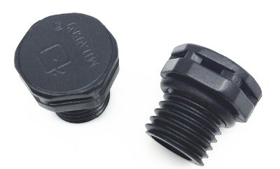

   Milvent M12

Li-Po Battery
~~~~~~~~~~~~~

LI-PO 3.7V 2200mAH Polymer Lithium Ion

Features:

* Charge voltage 4.2V, nominal voltage 3.7V, cut-off voltage 3.0V
* Max charge current 2200mAh
* Max discharge current 4400mAh
* Impedance 60mOhm at 1KHz
* Operating temperature: at charge 0-55C, at discharge -25C+60C
* Capacity loss after 500 cycles full charge/discharge at 20C: 20%
* Dimensions 63 x 44 x 6mm

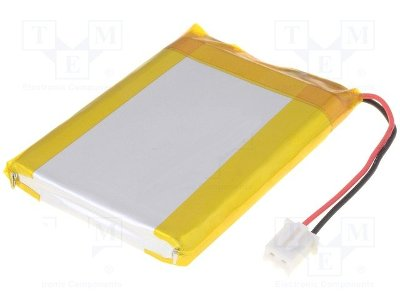

   LI-PO 3.7V 2200mAH

Module
------

LoPy
~~~~

MicroPython enabled microcontroller

LoPy Features:

* Powerful CPU, BLE and state of the art WiFi radio. 1KM Wifi Range
* Can also double up as Nano LoRa gateway
* MicroPython enabled
* Fits in a standard breadboard (with headers)
* Ultra-low power usage: a fraction compared to other connected micro controllers

Processing:

* Espressif ESP32 chipset
* Dual processor + WiFi radio System on chip
* Network processor handles the WiFi connectivity and the IPv6 stack
* Main processor is entirely free to run the user application
* An extra ULP-coprocessor that can monitor GPIOs, the ADC channels and control most of the internal peripherals during deep-sleep mode while only consuming 25uA

Operating Frequencies:

* 868 MHz (Europe) at +14dBm maximum
* 915 MHz (North and South America, Australia and New Zealand) at +20dBm maximum

Range Specification:

* Node range: Up to 40km
* Nano-gateway: Up to 22km
* Nano-gateway capacity: Up to 100 nodes

Interfaces:

* 2 x UART, 2 x SPI, I2C, I2S, micro SD card
* Analog channels: 8×12 bit ADCs
* Timers: 4×16 bit with PWM and input capture
* DMA on all peripherals
* GPIO: Up to 24

Security & Certifications:

* SSL/TLS support
* WPA Enterprise security
* FCC – 2AJMTLOPY1R
* CE 0700

Memory:

* RAM: 512KB
* External flash: 4MB
* Hardware floating point acceleration
* Python multi-threading

Hash / encryption:

* SHA, MD5, DES, AES

WiFi:

* 802.1b/g/n 16mbps

Bluetooth:

* Low energy and classic

RTC:

* Running at 32KHz

Power:

* Input: 3.3V – 5.5V
* 3v3 output capable of sourcing up to 400mA
* WiFi: 12mA in active mode, 5uA in standby
* LoRa: 15mA in active mode, 1-uA in standby

LoRa Specification:

* Semtech LoRa transceiver SX1272
* LoRaWAN stack
* Class A and C devices

Size:

55mm x 20mm x 3.5mm (Without Headers)

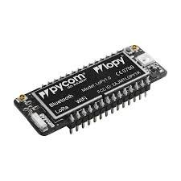

   Lopy v1.2

Pysense
~~~~~~~

Features

* Ambient light sensor
* Barometric pressure sensor
* Humidity sensor
* 3 axis 12-bit accelerometer
* Temperature sensor
* USB port with serial access
* LiPo battery charger
* MicroSD card compatibility
* Ultra low power operation (~1uA in deep sleep)
* Dimensions: 55mm x 35mm x 10mm

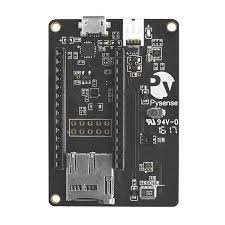

   Pysense v1.2

Antenna
~~~~~~~

LoRa (868MHz/915MHz)

* External antenna.
* RF Cable Assemblies RP-SMA (Female) JK-IPEX MHF U.FL 1.13 100MM
* RP-SMA (Male) Tilt Swivel 1/2 Wave Whip antenna

Connectors
----------

I2C Hub
~~~~~~~

I2C Hub Grove is an extension Grove module for connecting multiply I2C devices

* Use with cable:  Universal 4 Pin to X2 4 Pin cable
* Dimensions: 40mm x 20mm x 15mm

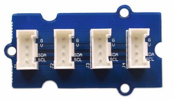

   Grove - I2C hub

+-----+--------+
| Pin | Color  |
+=====+========+
| GND | BALCK  |
+-----+--------+
| VCC | RED    |
+-----+--------+
| SDA | WHITE  |
+-----+--------+
| SCL | YELLOW |
+-----+--------+

Features:

* Chain able

Cables
~~~~~~

* 20cm - 4 Pin Grove I2C cable with connector
* 5cm - 4 Pin Grove I2C cable with connector
* JST 2 Pin power connector

I2C Cable
~~~~~~~~~~

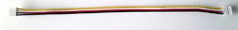

I2C Jump Cable
~~~~~~~~~~~~~~

Jumper Wires

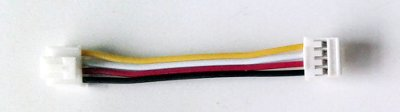

Enclosure
---------

* Dimensions: 8.8 x 14.6 x 3.3 cm

Spacers Screws
~~~~~~~~~~~~~~

Screws for mounting internals

Type: M2

O Ring Seal
~~~~~~~~~~~

Flexible Rubber O Ring Seal Washer Gasket Black

* Dimensions: OD 16mm x CS 2mm

