:title: Smart Agriculture Prototype
:date: 2017-03-28 21:48
:modified: 2020-03-12 11:22
:summary: DIY - device for taking micro climate measurements
:slug: vinode
:authors: Tomaz
:tags: lorawan, iot, python, micropython
:category: blog

.. contents:: Table of Contents

Prototype for monitor the micro-climate conditions in agriculture.
Collecting data from orchard/vineyards with purpose to support/help/extends the
decisions in deals with pests/diseases.

Vinode
======

**Live data:** `https://lepavida.iot.novagorica.eu`_

.. _`https://lepavida.iot.novagorica.eu`: https://lepavida.iot.novagorica.eu/d/BfjRxSpWz/vinode?orgId=1&refresh=30s&from=now-30d&to=now

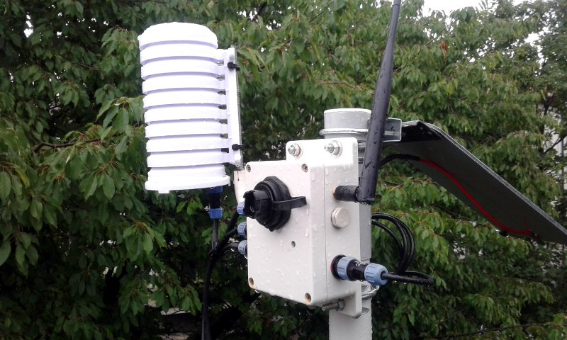

Issue
-----

* Fight the danger of downy mildew that in recent years has created serious
  damage across vineyards

* Adopt a scientific instrument to support
  decisions in order to carry out targeted interventions in the vineyard

Solution 
--------

IoT (Internet of Things) system which consists of interconnected devices that
operate and automatically communicate over long distances thanks to the use of
the LoRaWAN technology.

* **LoRaWAN device with sensors**: that measure, in real time, the
  micro-climatic conditions in the vineyard (responsible for fungal diseases
  such as downy mildew) and the physio-pathological status of the plant

* **LoRaWAN Gateway**: collection and transmission of data detected by the
  wireless sensors

`How to setup LoRaWAN Gateway`_

.. _`How to setup LoRaWAN Gateway`: {filename}/proj-gw-ic880a.rst

The LoRa technology makes it possible to overcome the problem of distance and
“physical interference”, two common conditions when you consider the nature of
the viticultural land, very often characterized by slopes, wild
vegetation and hilly landscapes.

Monitor the vineyard in real time and continuously, as well as the storage of
the historic data, which will be crucial for the organization and management of
the vineyard, not only of the current season but also of those to come.

`Read more about LoRaWAN`_

.. _`Read more about LoRaWAN`: {filename}/lorawan.rst

Project example with  MicroPython on esp-32 (lopy) to collect data (weather, soil, leafs..) on
micro-locations.

Overview
========

- Device
    The main measurements unit for taking measurements, logging and sending data.
    Powered with LiPo battery and optional solar power.

- Antenna
    It's part of device and responsible for transmitting and receiving data from LoRaWAN network gateways

- Led
    On device cover is Led indicator active only in when running in development mode

- Connectors
    Device is equipped with four (4-Pin) circular connectors for sensors
    and one (2-Pin) circular connector for solar power supply.

- USB External
    It's USB socket on device cover, used as programming port or
    external power supply (example is Power bank)

- Shield
    Holding and protecting ambient sensors from environment.
    Contains 3 sensors:
    * Air Temperature (Celsius)
    * Air Humidity (relative %H)
    * Light (lux)

- Leaf sensor
    Getting measurements of leaf wetness on TOP/BOTTOM in (%)

- Soil Moisture
    Getting measurements of soil capacitance in (%) and temperature in (℃ )

- Solar panel:
    It's 3.5W solar panel responsible for providing power supply

Specifications
--------------

- 1x Air temperature and relative humidity sensor
- 1x Barometric Pressure sensor
- 1x Luminosity sensor
- 1x Leaf wetness sensor
- 2x Soil moisture humidity and temperature sensor
- 1x Internal temperature sensor
- 1x Internal humidity sensor
- Solar panel with battery charger
- Data logger with internal data storage

Ports
~~~~~

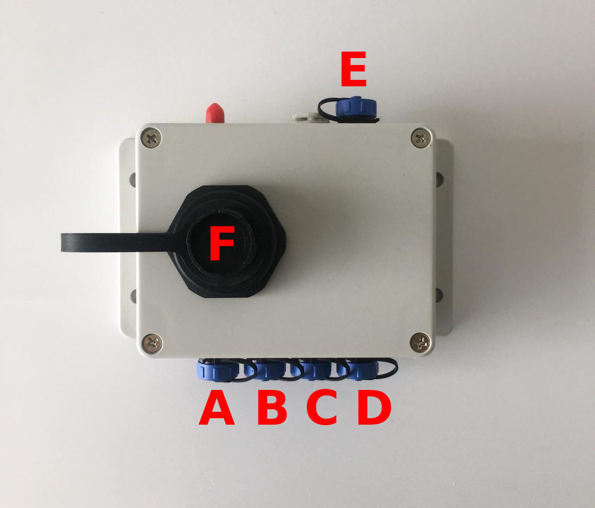

.. table:: Sockets

  +--------+------+------------------+
  | Socket | Type | Description      |
  +========+======+==================+
  | A      | I2C  | Shield connector |
  +--------+------+------------------+
  | B      | I2C  | Soil 1           |
  +--------+------+------------------+
  | C      | I2C  | Soil 2           |
  +--------+------+------------------+
  | D      | ADC  | Leaf             |
  +--------+------+------------------+
  | F      | USB  | USB socket (5V)  |
  +--------+------+------------------+
  | E      | 5V   | Solar            |
  +--------+------+------------------+

.. note:: The sensors must follow the connectors types.
          Sensors comunicating over I2C, they can be attached to any
          port (1-3), the 4th port is only for Leaf sensor!

Measurements
------------

* `Get credentials`_

.. _`Get credentials`: https://console.thethingsnetwork.org/applications/<APPID>

* `API reference`_

.. _`API reference`: https://www.thethingsnetwork.org/docs/applications/mqtt/api.html

* `PEM CA`_

.. _`PEM CA`: https://console.thethingsnetwork.org/mqtt-ca.pem

.. code-block:: text

  APPID - mqtt username
  APPKEY (default) - mqtt password

Example config:

.. code-block:: text

    MQTT_BROKER_PORT = 8883
    MQTT_BROKER_URL = 'eu.thethings.network'
    MQTT_USERNAME = <USERNAME>
    MQTT_PASSWORD = 'ttn-account-v2.<CHANGE-WITH-KEY>'

MQTT Topic all devices

.. code-block:: text

    '<CHANGE-WITH-APP_ID>/devices/+/up'

MQTT Topic specified devices

.. code-block:: text

    '<CHANGE-WITH-APP_ID>/devices/<CHANGE-WITH-DEVICE_ID>/up'

Example playload fields:

.. code-block:: json

    {
      "ahum": 0,
      "alight": 0,
      "atemp": 0,
      "bat": 4.732,
      "ihum": 68.83,
      "ilight": 0,
      "ipress": 1002,
      "itemp": 28.28,
      "lwbottom": 1,
      "lwtop": 0,
      "mcapa1": 17,
      "mcapa2": 14,
      "mtemp1": 27.2,
      "mtemp2": 26.7
    }

Message Payload
---------------

Data transmitted over LoRaWAN is decoded into bytes before sending over
the air

.. table::

  +-------+----------+-------+---------+-------------------------+
  | Index | Name     | Bytes | Numeric | Description             |
  +=======+==========+=======+=========+=========================+
  | 1     | alight   | `(3)` | int     | Ambient Light           |
  +-------+----------+-------+---------+-------------------------+
  | 2     | atemp    | `(2)` | float   | Ambient Temperature     |
  +-------+----------+-------+---------+-------------------------+
  | 3     | ahum     | `(2)` | float   | Ambient Humidity        |
  +-------+----------+-------+---------+-------------------------+
  | 4     | mcapa1   | `(2)` | int     | Moisture #1 Capacitance |
  +-------+----------+-------+---------+-------------------------+
  | 5     | mtemp1   | `(2)` | float   | Moisture #1 Temperature |
  +-------+----------+-------+---------+-------------------------+
  | 6     | mcapa2   | `(2)` | int     | Moisture #2 Capacitance |
  +-------+----------+-------+---------+-------------------------+
  | 7     | mtemp2   | `(2)` | float   | Moisture #2 Temperature |
  +-------+----------+-------+---------+-------------------------+
  | 8     | lwtop    | `(2)` | int     | Leaf Wetness Top        |
  +-------+----------+-------+---------+-------------------------+
  | 9     | lwbottom | `(2)` | int     | Leaf Wetness Bottom     |
  +-------+----------+-------+---------+-------------------------+
  | 10    | bat      | `(3)` | float   | Pysense Voltage         |
  +-------+----------+-------+---------+-------------------------+
  | 11    | temp     | `(2)` | float   | Pysense Temperature     |
  +-------+----------+-------+---------+-------------------------+
  | 13    | hum      | `(2)` | float   | Pysense Humidity        |
  +-------+----------+-------+---------+-------------------------+
  | 14    | light    | `(3)` | int     | Pysense Light           |
  +-------+----------+-------+---------+-------------------------+
  | 15    | press    | `(3)` | int     | Pysense Pressure        |
  +-------+----------+-------+---------+-------------------------+

Change log
==========

.. table::

  +---------+------------+-------------+
  | Version | Date       | Description |
  +=========+============+=============+
  | v001    | 06.21.2017 | Prototype   |
  +---------+------------+-------------+
  | v002    | 28.08.2017 | Prototype   |
  +---------+------------+-------------+
  | v003    | 21.09.2017 | Prototype   |
  +---------+------------+-------------+
  | v1.0    | 26.11.2017 | Alpha       |
  +---------+------------+-------------+
  | v1.0    | 30.01.2018 | Beta        |
  +---------+------------+-------------+
  | v1.0    | 21.02.2018 | RC          |
  +---------+------------+-------------+
  | v2.0    | 27.08.2019 | RC_1        |
  +---------+------------+-------------+
  | v2.1    | 07.09.2019 | RC_2        |
  +---------+------------+-------------+

Current position
----------------

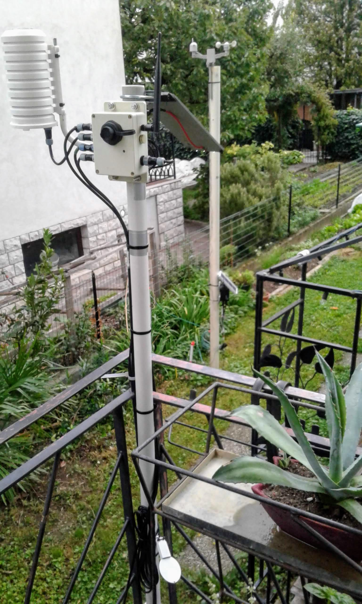

  Vinode v2.1
  

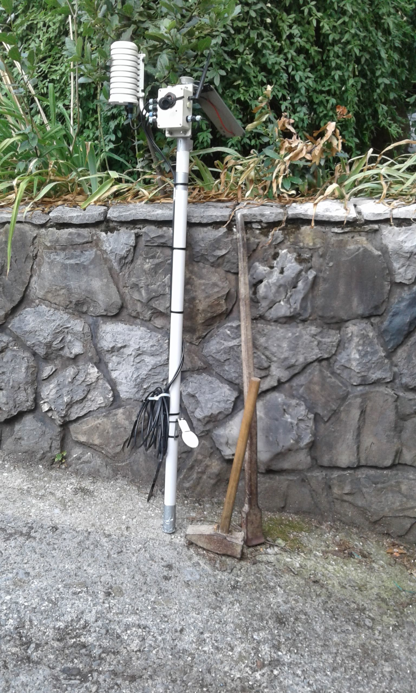

  vinode v2.0 & deploy tools

Prototype
---------

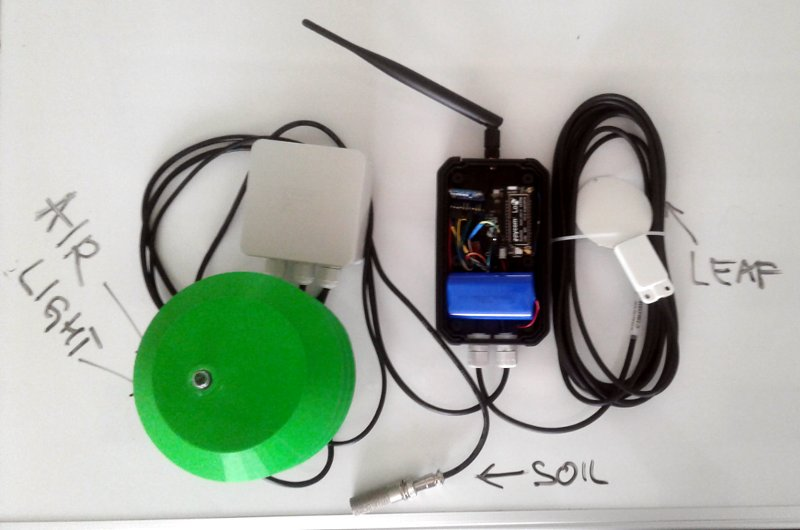

    Release - vinode001

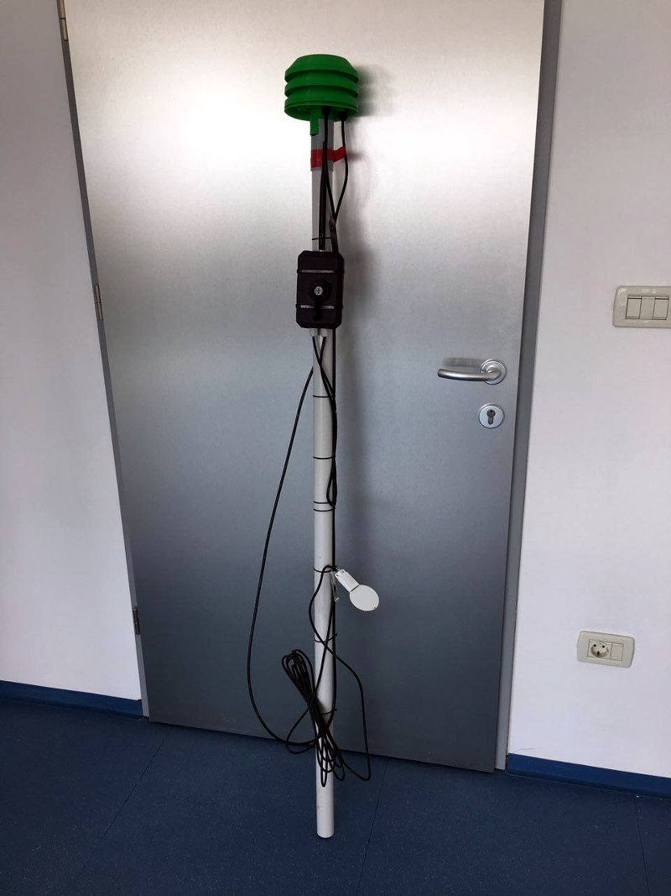

    Release - vinode002

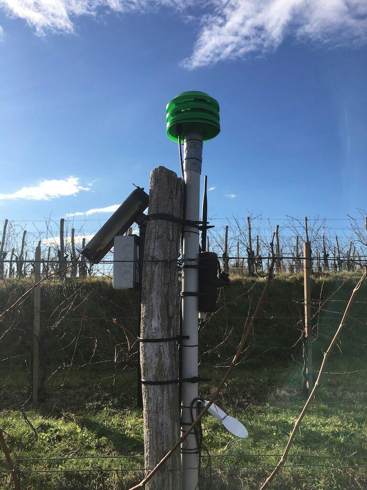

    Release - vinode003

Version 1.0
-----------

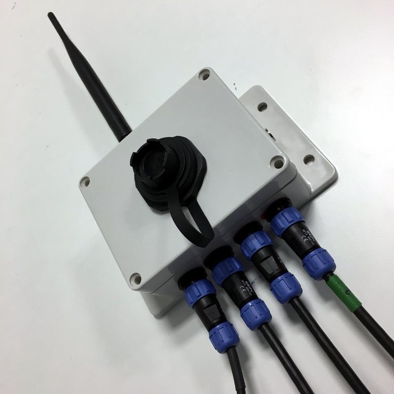

    Release - vinode-v1.0.0-alpha

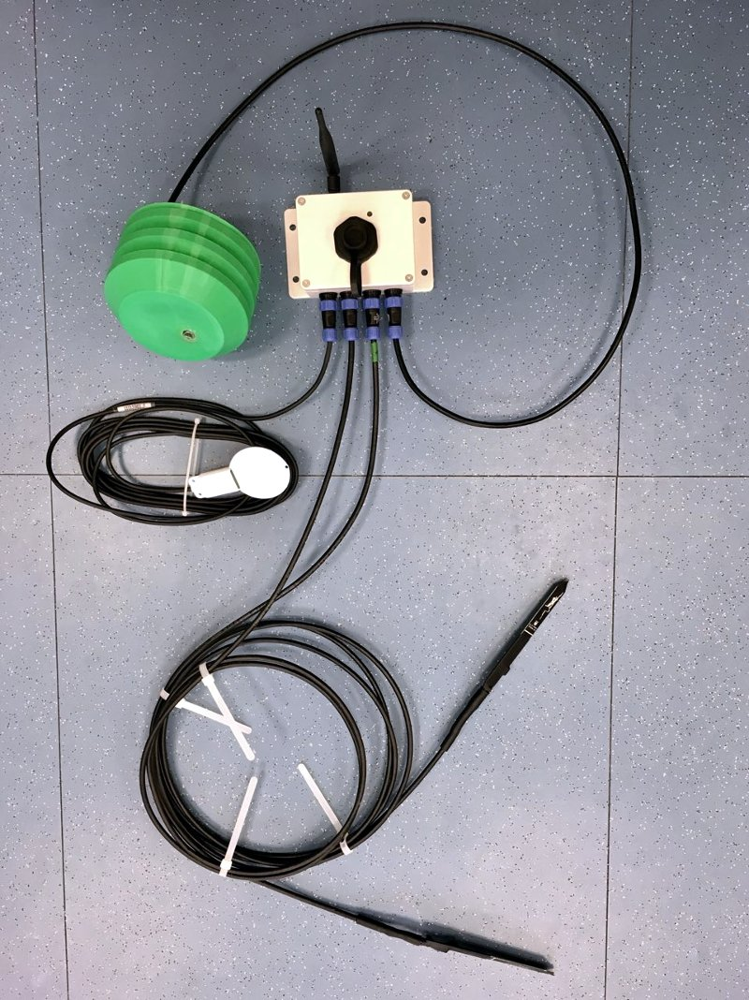

    Release - vinode-v1.0.0-alpha with sensors

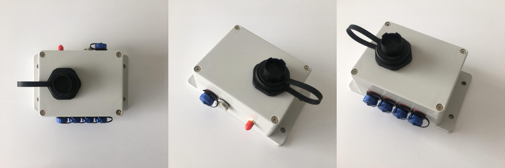

    Release - vinode-v1.0.0-beta

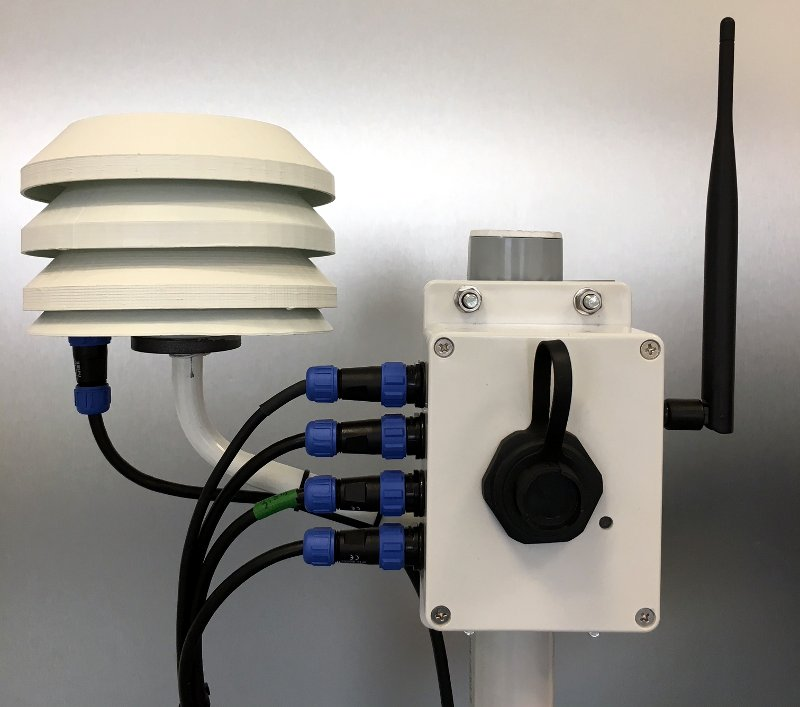

    Release - vinode-v1.0.0-beta assemble

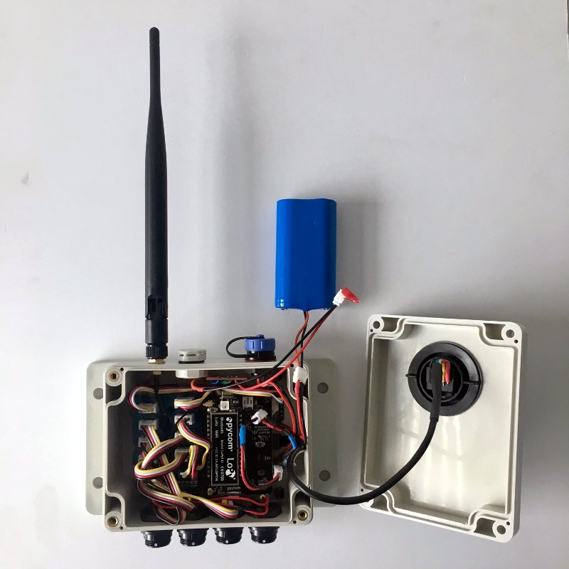

    Release - vinode-v1.0.0-rc

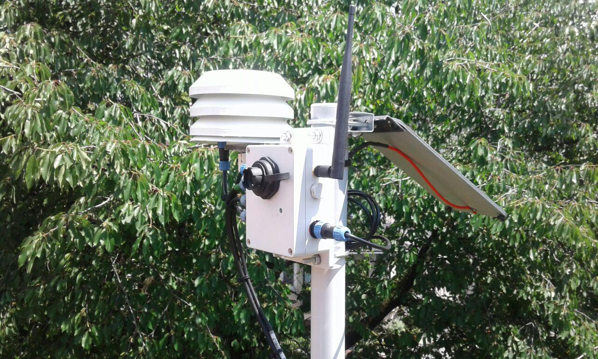

    Release - vinode-v1.0.0-rc1

Stand Version 1.0
-----------------

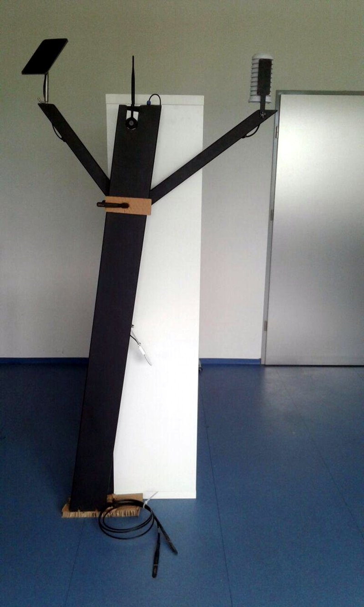

    Release - vinode-stand-v1.0.0
