:Title: Setup LoRaWAN gateway
:Date: 2017-09-03 22:46
:Modified: 2020-03-12 11:22
:Tags: iot, lorawan, gateway, network, ic880a
:Category: projects
:authors: Tomaz
:Slug: setup-lorawan-gateway
:Summary: Notes for assembling LoRaWAN gateway
:banner: ../images/lorawan-gw/2019-08-31_15.33.53.jpg

.. figure:: images/lorawan-gw/2019-08-31_15.33.53.jpg
  :alt: Image

.. contents:: Table of Contents

Setup LoRaWAN Gateway
======================

The document describe assembling and setup the LoRaWAN packet forwarder
with IMST ic800a backplate and Raspberry pi.

Overview
--------

* Solder headers on backplate ic880a adapter
* Assemble ic880a concentrator plate and adapter
* Assemble ic880a concentrator and Raspberry pi (use of stendoffs only for Rpi3 combination)
* Wiring UBEC and passive PoE
* Connect UBEC between Rasberry and ic880a concentrator plate
* Connect antena on ic880a concentrator
* Setting up softwarewre
* Install inside enclosure

Assemble
--------

1. Solder headers on backplate
~~~~~~~~~~~~~~~~~~~~~~~~~~~~~~

On top of the plate solder headers for concentrator

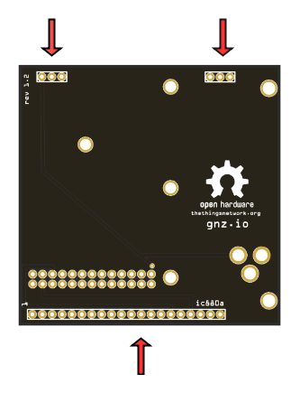

    Backplate top face

On bottom of the plate solder headers for Raspberry PI

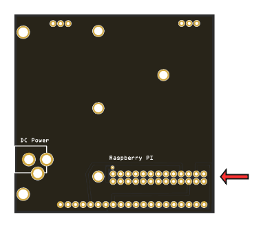

    Backplate bottom face

Reference images for ic880a

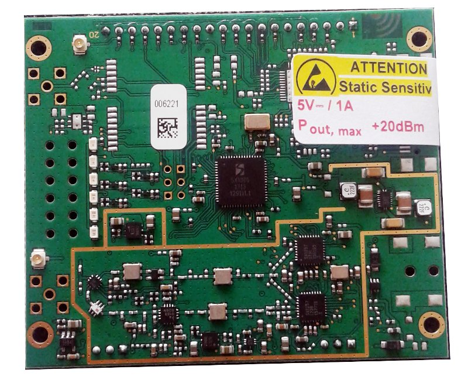

    Concetrator plate top

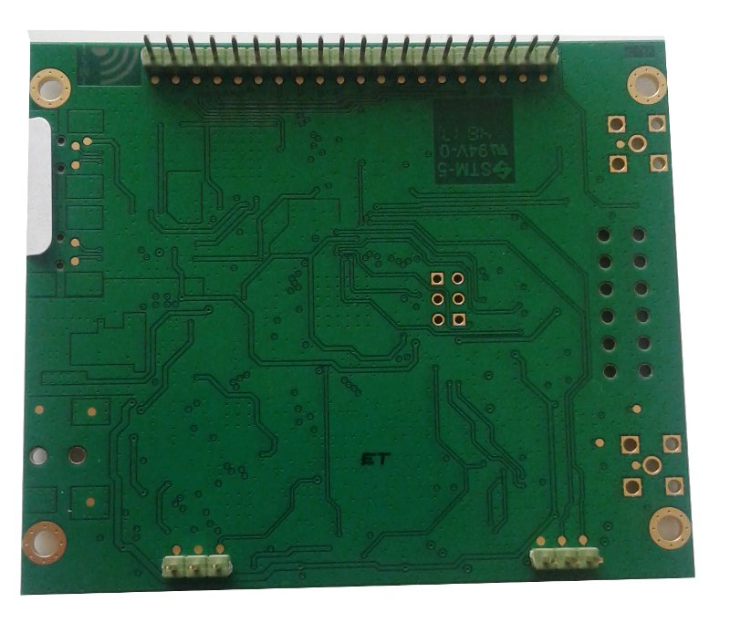

    Concetrator plate bottom

2. Assemble concentrator plate and adapter
~~~~~~~~~~~~~~~~~~~~~~~~~~~~~~~~~~~~~~~~~~

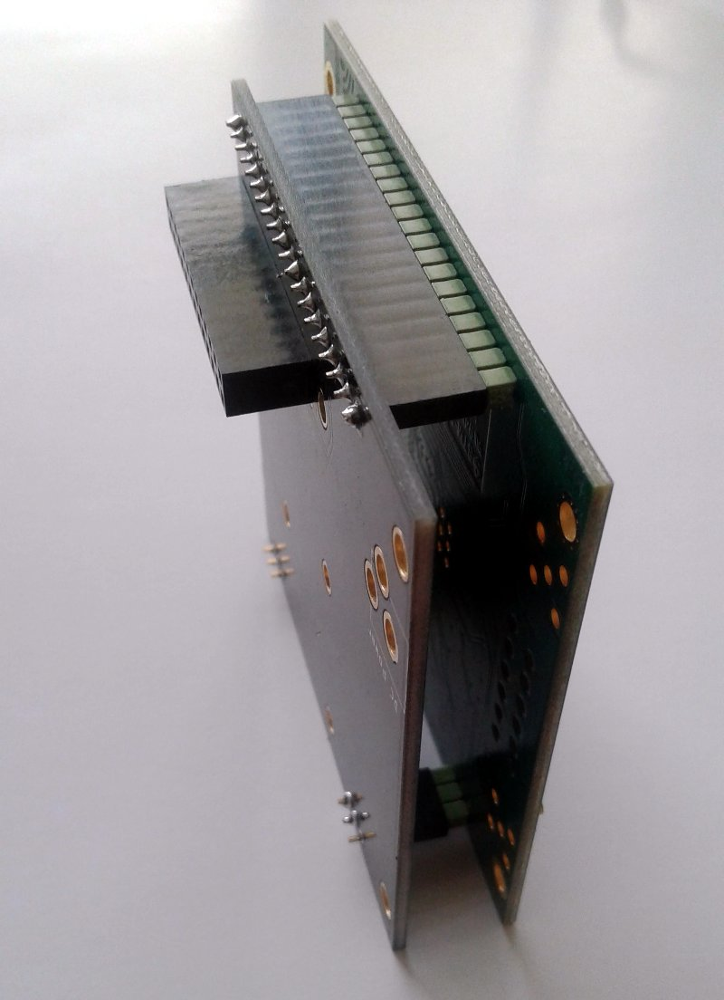

    Mouned concentrator on back plate

3. Assemble Raspberry Pi and concentrator
~~~~~~~~~~~~~~~~~~~~~~~~~~~~~~~~~~~~~~~~~

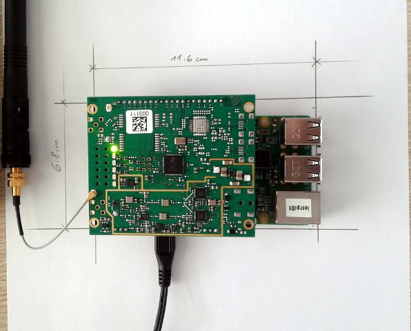

    pi and concentrator top view

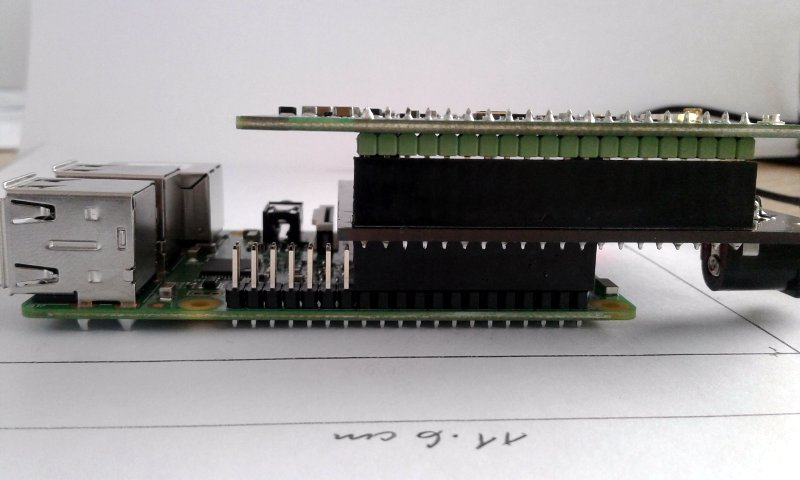

    pi and concentrator side view

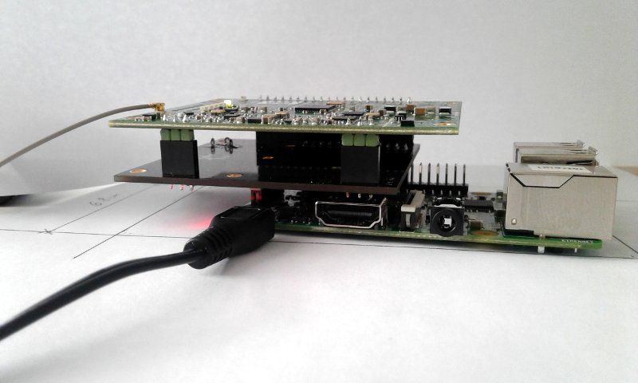

    pi3 and concentrator side view

3. Wiring UBEC and passive PoE
~~~~~~~~~~~~~~~~~~~~~~~~~~~~~~

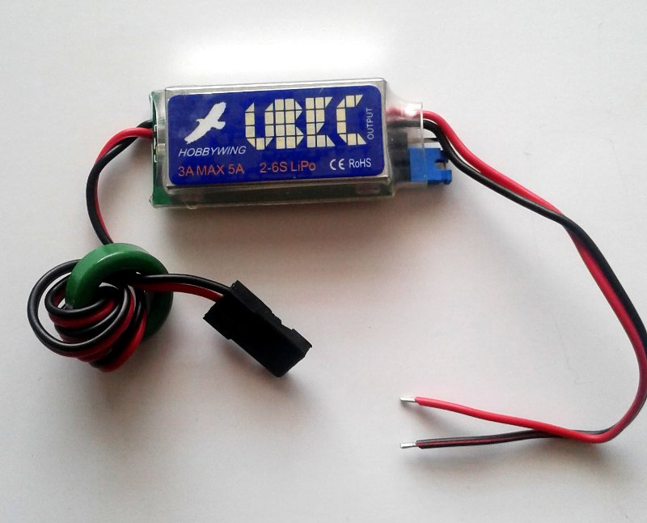

    UBEC top

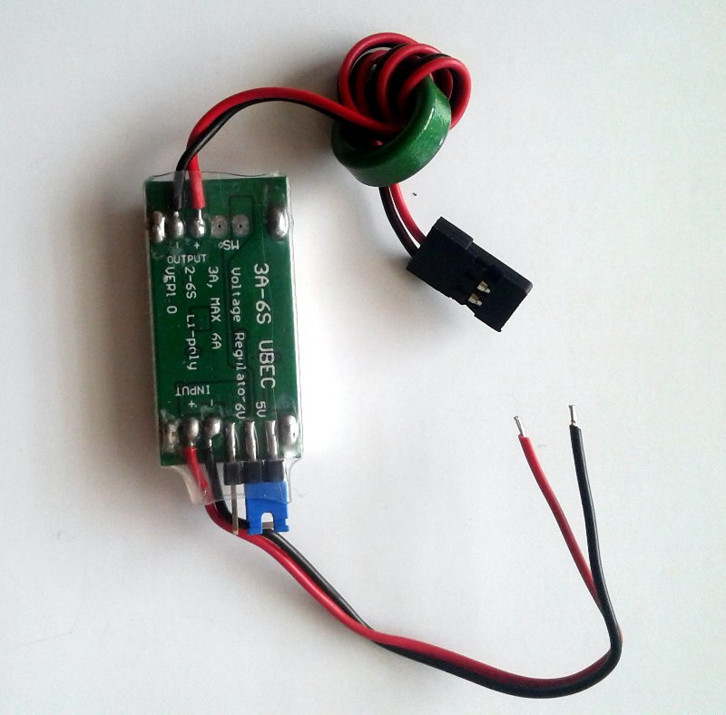

    UBEC bottom

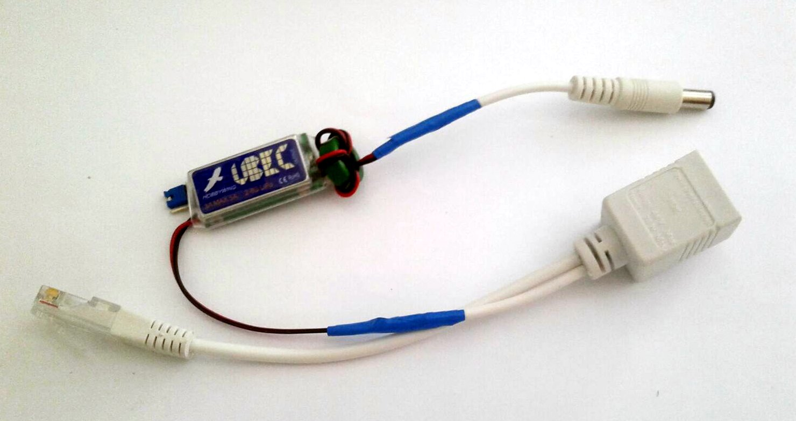

    UBEC wiring with passive PoE

4. Connect antena on concentrator
~~~~~~~~~~~~~~~~~~~~~~~~~~~~~~~~~

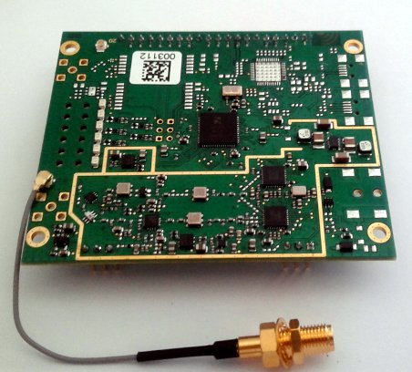

    Antenna connect to concentrator

Pins definition
---------------

Reference for pin definition on ic880a and Raspberry Pi

+------------+-------------+------------------+
| iC880a pin | Description | RPi physical pin |
+============+=============+==================+
| 21         | Supply 5V   | 2                |
+------------+-------------+------------------+
| 22         | GND         | 6                |
+------------+-------------+------------------+
| 13         | Reset       | 22               |
+------------+-------------+------------------+
| 14         | SPI CLK     | 23               |
+------------+-------------+------------------+
| 15         | MISO        | 21               |
+------------+-------------+------------------+
| 16         | MOSI        | 19               |
+------------+-------------+------------------+
| 17         | NSS         | 24               |
+------------+-------------+------------------+

Setting up softwarewre
----------------------

Raspery PI setup
~~~~~~~~~~~~~~~~

* Enable SPI
* Set time
* New sudo user
* Setup ssh key olny access
* Delete pi user
* Firewall
* Auto install security updates (yes/No)
* Fail2Ban
* Install common tools
* Upgrade
* Setup vpn

Setup packet forwarder
------------------------

https://github.com/ch2i/LoraGW-Setup

References
----------

Example setup - https://github.com/ttn-zh/ic880a-gateway/wiki

Hardware components
===================

+-----+--------------------------------+-----------------------------------------------------------+
| Qty | Name                           | Description                                               |
+=====+================================+===========================================================+
| 1   | `iC880a`_                      | Concentrator board                                        |
+-----+--------------------------------+-----------------------------------------------------------+
| 1   | `SMA Antenna`_                 | SMA Antenna for iC880A-SPI, WSA01-iM880B and Lite Gateway |
+-----+--------------------------------+-----------------------------------------------------------+
| 1   | `Pigtail`_                     | u.fl to SMA Pigtail cable for iC880A-SPI                  |
+-----+--------------------------------+-----------------------------------------------------------+
| 1   | `iC880a interface`_            | RPi adapter plate                                         |
+-----+--------------------------------+-----------------------------------------------------------+
| 1   | `Enclosure 1`_                 | RF Elements StationBox® ALU StationBox                    |
+-----+--------------------------------+-----------------------------------------------------------+
| 1   | `Enclosure 2`_                 | RF Elements - StationBox® Classic                         |
+-----+--------------------------------+-----------------------------------------------------------+
| 1   | `PoE Adapter`_                 |                                                           |
+-----+--------------------------------+-----------------------------------------------------------+
| 1   | `Rpi`_                         | Raspberry Pi (v3)                                         |
+-----+--------------------------------+-----------------------------------------------------------+
| 1   | `SD Card`_                     | MicroSD Card (16Gb)                                       |
+-----+--------------------------------+-----------------------------------------------------------+
| 1   | `RTL-SDR`_                     | USB dongle                                                |
+-----+--------------------------------+-----------------------------------------------------------+
| 1   | Belden H155 PE                 | Coax cable antenna                                        |
+-----+--------------------------------+-----------------------------------------------------------+
| 1   | N Male H155                    |                                                           |
+-----+--------------------------------+-----------------------------------------------------------+
| 1   | N FeMale panel 4L              |                                                           |
+-----+--------------------------------+-----------------------------------------------------------+
| 1   | U Objenka Antenna              |                                                           |
+-----+--------------------------------+-----------------------------------------------------------+
| 1   | External RJ45 PE               | ETH                                                       |
+-----+--------------------------------+-----------------------------------------------------------+
| 1   | PoE usmernik DC 15V / 0.8A     |                                                           |
+-----+--------------------------------+-----------------------------------------------------------+
| 1   | 5V 3A UBEC Step-Down Converter |                                                           |
+-----+--------------------------------+-----------------------------------------------------------+
| 1   | Standoff screw                 | Keep parts separated for 11mm                             |
+-----+--------------------------------+-----------------------------------------------------------+

.. _iC880a: http://shop.imst.de/wireless-modules/lora-products/8/ic880a-spi-lorawan-concentrator-868-mhz?c=11
.. _SMA Antenna: http://shop.imst.de/wireless-modules/accessories/19/sma-antenna-for-ic880a-spi-wsa01-im880b-and-lite-gateway
.. _Pigtail: http://shop.imst.de/wireless-modules/accessories/20/u.fl-to-sma-pigtail-cable-for-ic880a-spi
.. _iC880a interface: https://www.tindie.com/products/gnz/imst-ic880a-lorawan-backplane-kit/?pt=ac_prod_search
.. _Enclosure 1: https://www.amazon.de/RF-Elements-StationBox-ALU-StationBox/dp/B00FJY5FD4
.. _Enclosure 2: http://www.nv-networks.com/en/rf-elements-stationboxr-classic-5-ghz-20-dbi.html
.. _RTL-SDR: https://shop.technofix.uk/sdr/usb-rtl-sdr-sticks/super-stable-1ppm-tcxo-r820t2-tuner-rtl2832u-rtl-sdr-usb-stick-version-3
.. _PoE Adapter: http://google.com
.. _RPi: http://google.com
.. _SD Card: http://google.com
.. _Standoff: https://www.pololu.com/product/1952

Hardware components mobile
==========================

+-----+---------------------+-----------------------------------------------------------+
| Qty | Name                | Description                                               |
+=====+=====================+===========================================================+
| 1   | `Rpi_zero`_         | Raspberry Pi Zero                                         |
+-----+---------------------+-----------------------------------------------------------+

.. _RPi_zero: https://eu.mouser.com/ProductDetail/SparkFun/DEV-14277?qs=sGAEpiMZZMuqBwn8WqcFUj2aNd7i9W7ukD5zwS1Hdc5ehym0zfrfkg%3d%3d

Examples
--------

.. figure:: images/lorawan-gw/2019-08-31_13.14.04.jpg
  :alt: Image

  #1 DIY Raspberry PI Zero & ic880a

.. figure:: images/lorawan-gw/2019-08-31_15.33.53.jpg
  :alt: Image

  #2 DIY Raspberry PI Zero & ic880a

Commercial solutions
====================

RAK7246
--------

* https://www.rakwireless.com/en-us/products/lorawan-gateways-and-concentrators/rak7246g

RAK7244
--------

* https://store.rakwireless.com/products/rak7244-developer-lorawan-gateway

TheThingsNetwork GW
-------------------

.. figure:: images/lorawan-gw/20190828_011017.jpg
  :alt: Image

  TheThingsNetwork Gw

