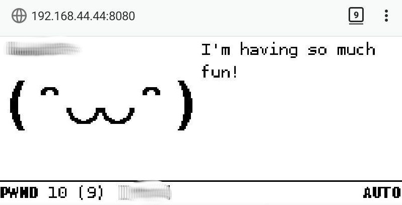
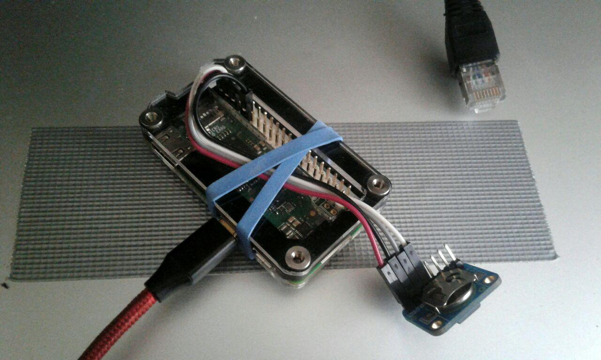
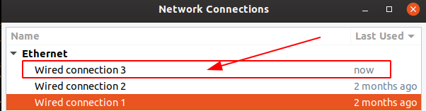
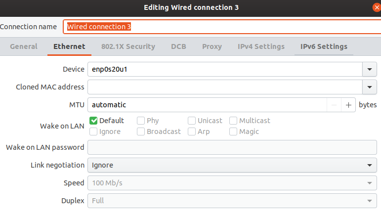
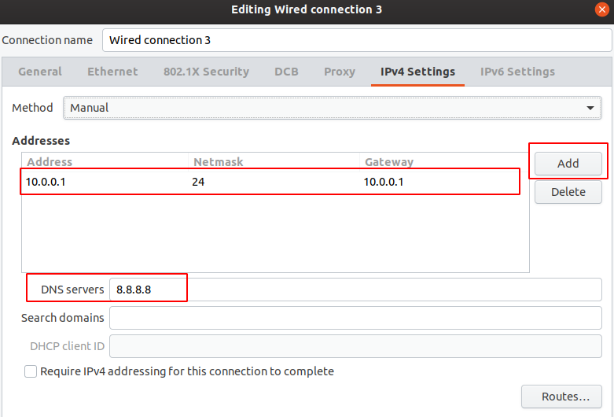

:title: Isolation Days With AI and Pwnagotchi
:date: 2020-04-05 17:29
:tags: wireless, network, ai, rl, hacktheplanet
:category: projects
:slug: pwnagotchi
:summary: Self isolation with an AI that wants to eat wireless handshakes #HackThePlanet
:banner: ../images/pwnagotchi/phone-web-ui.jpg

.. contents:: Table of Contents

Isolation Days With AI and Pwnagotchi
=======================================

.. |iu| image:: images/pwnagotchi/ui.jpg

As written on `pwnagotchi.ai`_:

.. _`pwnagotchi.ai`: https://pwnagotchi.ai/

  ...an excuse to learn about reinforcement learning and WiFi networking—and have a reason to get out for more walks.

The last claim, get out in this days, sounds wrong but with a deep sound of silence out there it's a big pleasure!
Driven with collecting data one way or another, this project is freaking out.

Hardware
---------

- Raspberry Pi Zero W
- Zebra Zero Raspberry Pi Zero Case - Black Ice
- SD card 16GB
- RTC DS3231 (for replacing fake-hw clock)
- Micro-USB cable (with enough wires to support data transfer)

RJ45 is banana for scale :)

**Next Upgrade:** `Black & White e-ink displays` - Waveshare eInk 2.13” Display V2 

Features
---------

- `AI`_ reinforcement learn on Wifi audits
- Support for `e-ink displays`_
- `Bluetooth`_ connection sharing and web UI on phone 
- `PwnMAIL`_ an "crypto-pager" 
- `BetterCAP’s`_ web UI (only in MANU mode) 

.. _`AI`: https://pwnagotchi.ai/usage/#ai
.. _`e-ink displays`: https://pwnagotchi.ai/installation/#display
.. _`Bluetooth`: https://pwnagotchi.ai/configuration/#bluetooth
.. _`PwnMAIL`: https://pwnagotchi.ai/usage/#pwnmail
.. _`BetterCAP’s`: https://pwnagotchi.ai/usage/#bettercap-s-web-ui

And of course the community `r/pwnagotchi`_

.. _`r/pwnagotchi`: https://www.reddit.com/r/pwnagotchi/

Setup
-----

1. Flash the image on SD
^^^^^^^^^^^^^^^^^^^^^^^^

.. code-block:: bash

  sudo pv -tpreb pwnagotchi-raspbian-lite-v1.4.3.img | sudo dd of=/dev/mmcblk0 bs=512K

More details: https://pwnagotchi.ai/installation/#flashing-an-image

2. Before first boot
^^^^^^^^^^^^^^^^^^^^

Add ``config.yml`` to ``/boot`` partition on SD card.

If not sure about valid ``YAML`` syntax check your config with online
validator - https://codebeautify.org/yaml-validator

.. code-block:: yml

  main:
    name: '<CHANGE_TO_NAME_FOR_DEVICE>'
    whitelist:
      - '<CHANGE_THIS_TO_HOME_WIFI_BSSID_OR_ESSID>'
    plugins:
      grid:
        enabled: true
        report: true
        exclude:
          - '<CHANGE_THIS_TO_HOME_WIFI_BSSID_OR_ESSID>'
  ui:
      web:
          username: <CHANGE_THIS_TO_USERNAME_FOR_WEB_UI>
          password: <CHANGE_THIS_TO_PASSWORD_FOR_WEB_UI>

More details: https://pwnagotchi.ai/configuration/#initial-configuration
  
3. Boot
^^^^^^^

Plug Micro-USB into "DATA PORT" on Raspberry Pi Zero to run in OTG (On The Go)
mode allowing device to act as an Ethernet device.

Read more: https://pwnagotchi.ai/configuration/#connect-to-your-pwnagotchi

4. Find the device
^^^^^^^^^^^^^^^^^^

Find device assigned address. The address is different each time we change the
USB port it can be (enp0s20u1, or enp0s20u2 ...) this on Ubuntu machine.

.. code-block:: bash
  # View kernel messages for new plugged device
  $ dmesg

  # List usb device
  $ lsusb

  # check interfaces
  $ ip a

4. Setup network interfaces
^^^^^^^^^^^^^^^^^^^^^^^^^^^

Open Network connections manager (Ubuntu) and edit **Wire connection**

.. code-block:: bash

  $ nm-connection-editor

Select the new interface

Check the interface name

Add new static address under ``IPv4 Settings``

.. code-block:: text

    IP: 10.0.0.1
    Netmask: 255.255.255.0
    Gateway: 10.0.0.1
    DNS: 8.8.8.8 (or wathever)

Save and close and recheck the interface if settings are applied

.. code-block:: bash

  $ ip a

5. SSH into device
^^^^^^^^^^^^^^^^^^

Default password: **raspberry**

.. code-block:: bash

  $ ssh pi@10.0.0.2

  # Trubles with ssh
  # --
  # Received disconnect from 10.0.0.2 port 22:2: Too many authentication failures   
  # Disconnected from 10.0.0.2 port 22                                              
  # --

  $ ssh -o PreferredAuthentications=password pi@10.0.0.2

Using Android phone for interface
----------------------------------

Enable Bluetooth tethering on "Android phone" under: 

.. code-block:: text

  Settings: Connections --> Mobile Hotspot and Tethering

Then enable Bluetooth discovery scan on the phone.

Find phone MAC address: 

.. code-block:: text

  Settings -> About Phone -> Status 

1. Find phone MAC
^^^^^^^^^^^^^^^^^

Now SSH into the pwnagotchi and run the following command to find the phone:

**NOTE:** This is just example MAC address ``E:DB:EE:F0:CO:FE``

.. code-block:: bash

  $ sudo bluetoothctl
  $ scan on

  ......
  [NEW] Device DE:DB:EE:F0:CO:FE

2. Edit config
^^^^^^^^^^^^^^

For Android phones default address is ``192.168.44.x`` maybe :)

Add to ``/etc/pwnagotchi config.yml``

.. code-block:: yaml

    bt-tether:
      enabled: true
      devices:
        <CHANGE_TO_PHONE_NAME>:                 
          enabled: true         
          search_order: 1       
          mac: 'DE:DB:EE:F0:CO:FE' 
          ip: '192.168.44.44'   
          netmask: 24           
          interval: 1           
          scantime: 15          
          share_internet: true  
          priority: 99          
          max_tries: 0          

3. Paring
^^^^^^^^^^

Paring with phone

.. code-block:: bash

  pair DE:DB:EE:F0:CO:FE
  ...(pair) yes/no
  yes

  # here your phone will ask if you want to pair with some code ... say yes on phone and yes in terminal
  trust DE:DB:EE:F0:CO:FE

4. Restart in AUTO mode
^^^^^^^^^^^^^^^^^^^^^^^^

Shutdown pwnagotchi 

.. code-block:: bash

  $ sudo shutdown -h now

Change Micro-USB into **POWR port** on PI and plug into Power Bank or any other 5V power supply

Wait.... the Bluetooth connection with pwnagotchi need to established.

4. Verify bt-pan addres
^^^^^^^^^^^^^^^^^^^^^^^^

Verify if address added to config ``192.168.44.44`` is correct!

Using Termux on phone (note: the BT connection need to be established, to list the bt-pan interface)

.. code-block:: bash

  # ifconfig bt-pan

5. Access the Web UI on phone
^^^^^^^^^^^^^^^^^^^^^^^^^^^^^^

Open phone browser and point to url:

.. code-block:: bash

   http://192.168.44.44:8080

And now wait .. 15min or more for AI to begin 
