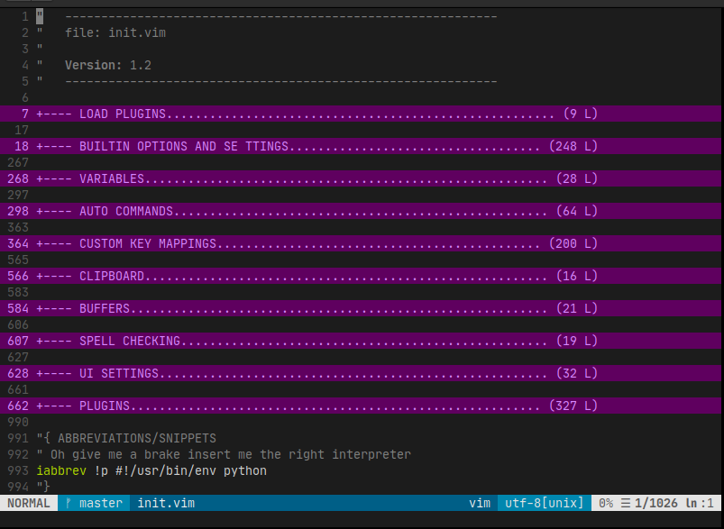
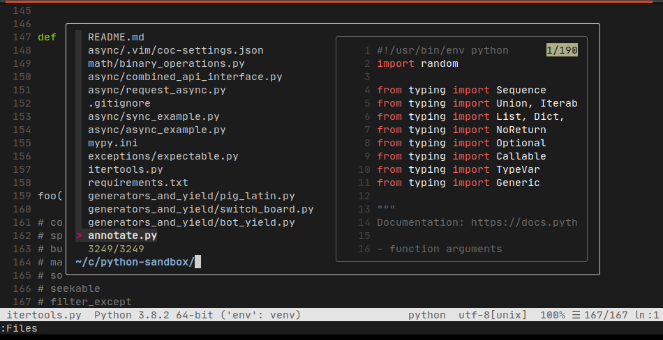
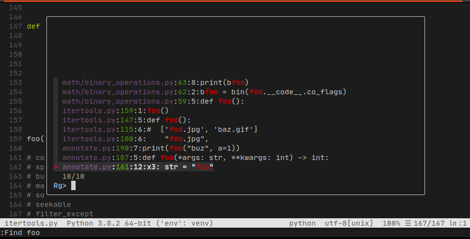
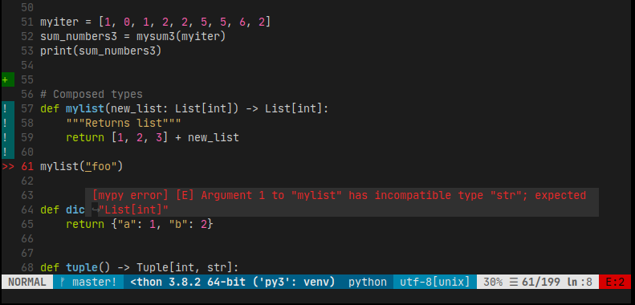
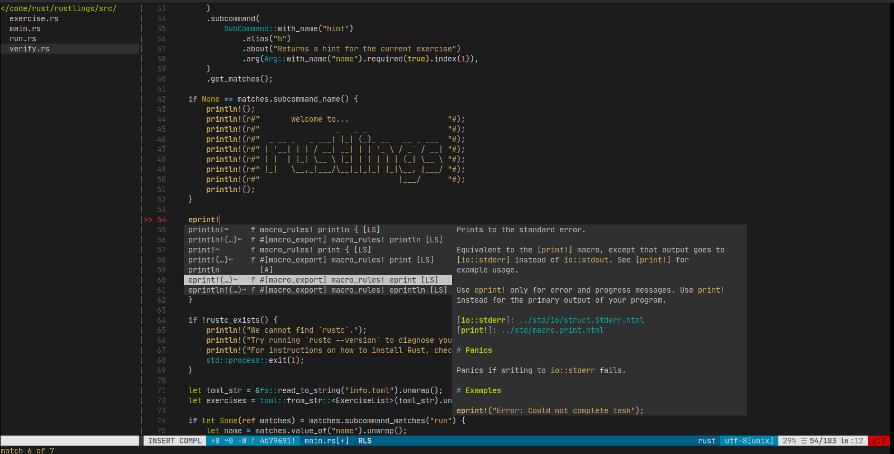
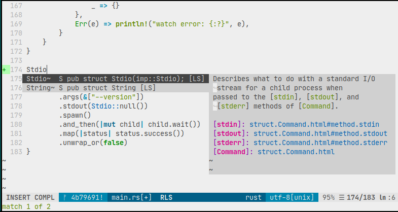

:Title: Vim User Disorder
:Date: Fri Sep 7 13:48:16 CEST 2018
:Modified: Jan 17, 2020
:Category: logs
:Tags: vim, tools
:Summary: Cheatsheet and notes for (neo)vim editor
:Banner: ../images/vim/neovim-banner.png

Currently using neovim for main work IDE.
Plugins for code linting, formating and auto completion and to work with git.

Config source: https://github.com/tomazursic/_nvim

Preview
~~~~~~~~

Edit neovim init.vim file

Search files with FZF and bat preview

Search for keyword with ripgrep in files content

Edit python file with mypy linter

Edit rust file and rust-analyzer

Light colorscheme

